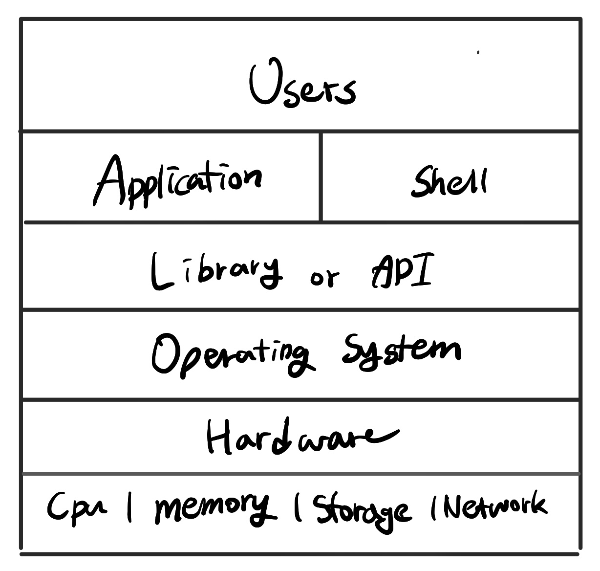
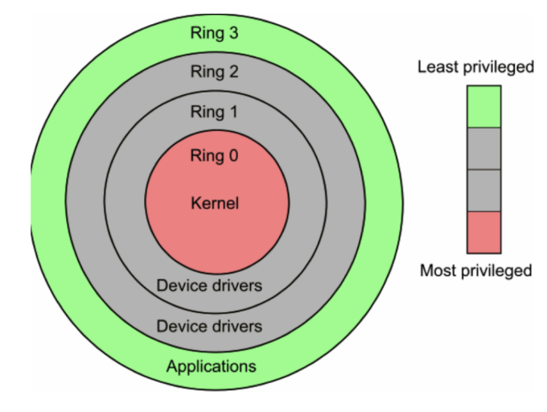
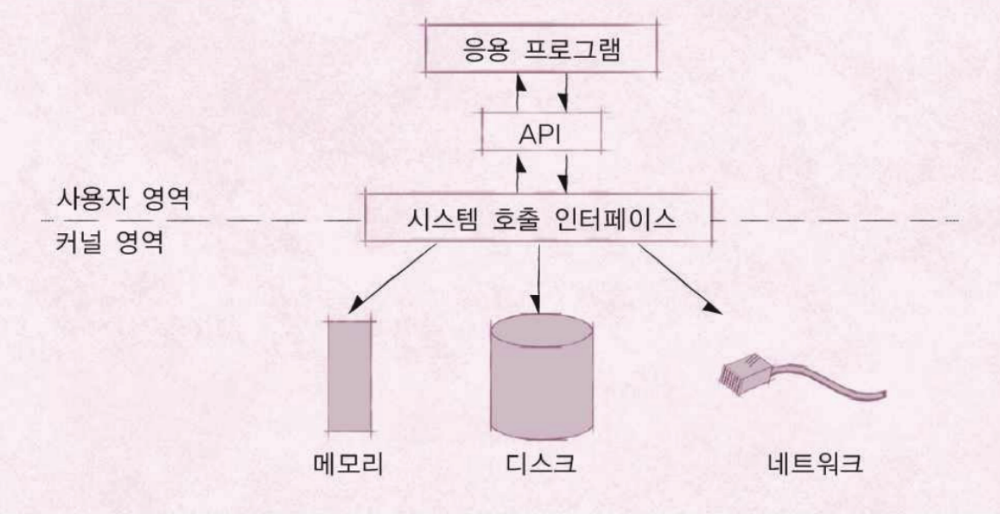

# 운영체제 구조

### 응용 프로그램, 운영체제, 컴퓨터 하드웨어(시스템 리소스) 관계
* 운영체제는 응용프로그램이 요청하는 메모리를 허가하고, 분배한다.
* 운영체제는 응용프로그램이 요청하는 CPU 시간을 제공한다.
* 운영체제는 응용프로그램이 요청하는 IO Devices 사용을 허가/제어한다.
-> 운영체제는 응용프로그램이 요청하는 시스템 자원을 제공한다.

- - - -

## 운영체제 _ 사용자 인터페이스 제공
#### 쉘 (Shell)
* 사용자가 운영체제 기능과 서비스를 조작할 수 있도록 인터페이스를 제공하는 응용 프로그램
* 터미널 환경(CLI)과 GUI 환경 두 종류로 분류

- - - -

## 운영체제 _ 응용 프로그램을 위한 인터페이스 제공
#### API (Application Programming Interface)
* 함수로 제공
* 보통은 Library 형태로 제공된다.

#### 시스템 콜
* 시스템 콜 또는 시스템 호출 인터페이스
* 운영체제가 제공하는 운영체제 각 기능을 사용할 수 있는 명령 또는 함수
> API 내부는 시스템을 호출하는 형태로 만들어지는 경우가 대부분이다.  
* 정의 Ex) POSIX API, 윈도우 API

- - - -

## CPU Protection Rings
* CPU도 **권한모드**를 가지고 있다.
1. 사용자 모드 (user mode by applications)
	* 응용 프로그램이 사용
2. 커널 모드. (Kernel mode by OS) 
	* 특권 명렁어 실행과 원하는 작업 수행을 위한 자원 접근을 가능케 하는 모드 
	* 운영체제 (OS) 가 사용

* **시스템콜**은 **커널 모드**로 실행
	* 커널 모드에서만 실행할 수 있는 기능들이 있다.
	* 커널 모드로 실행하기 위해서는, 반드시 시스템콜을 사용해야(거쳐야) 한다.
* 함부로 응용 프로그램이 전체 컴퓨터 시스템을 헤치지 못한다.

1. 운영체제 기능이 필요한 API 호출
2. 시스템 콜 호출
3. **커널 모드로 변경**
4. OS 내부에서 해당 명령 실행
5. 다시 응용 프로그램 (유저 모드)로 돌아간다.

- - - -

