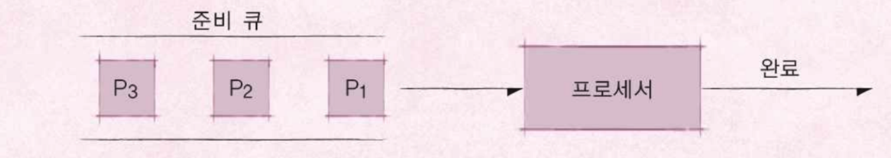
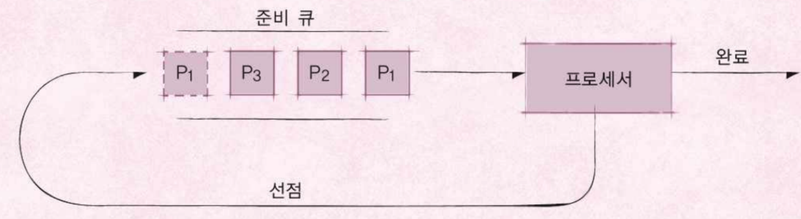
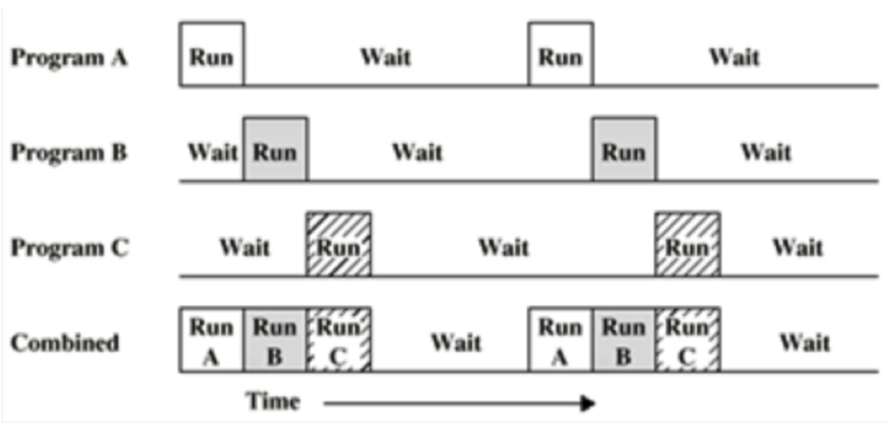
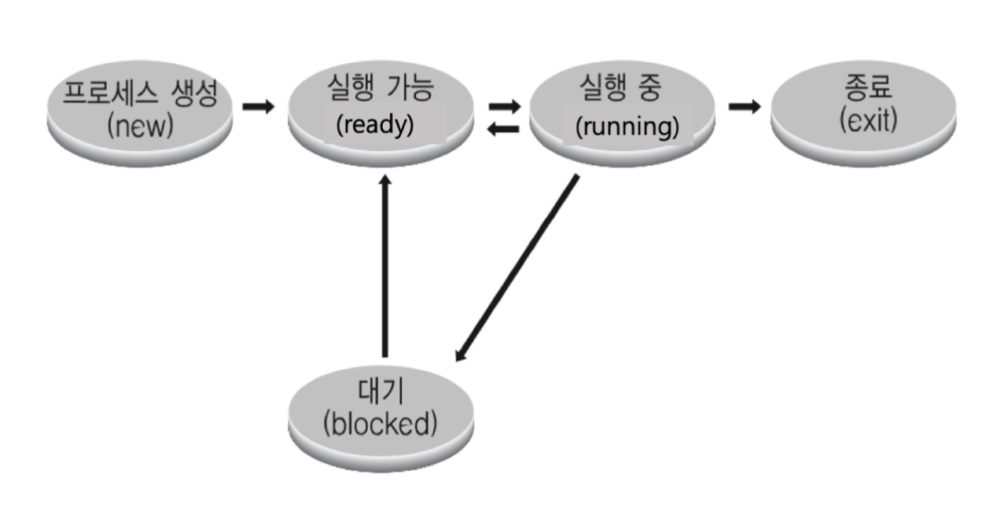
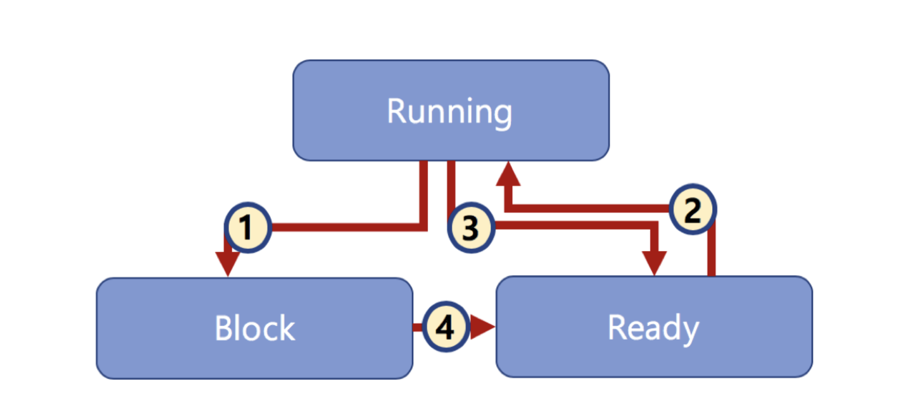

# 프로세스와 스케쥴러의 이해

## 프로세스 스케쥴링

#### 배치 처리 시스템
* 일괄 처리,  배치 처리, batch processing
* 컴퓨터 프로그램 실행 요청 순서에 따라 순차적으로 프로그램을 실행하는 방식
* 한 번에 등록된 여러 프로그램을 순차적으로 실행 가능
* 앞에 프로그램이 실행 시간이 너무 오래 걸리면, 다른 프로그램들이 실행하는 데 많이 기다려야 한다.

#### 시분할 시스템
* **다중 사용자 지원**을 위해 **컴퓨터 응답 시간**을 최소화하는 시스템

#### 멀티 태스킹
* 단일 CPU에서, **여러 응용 프로그램**이 **동시에** 실행되는 것처럼 보이도록 하는 시스템

#### 멀티 프로세싱
* **여러 CPU**에 **하나의 프로그램**을 병렬로 실행해, **실행 속도를 극대화**시키는 시스템

#### 멀티 프로그래밍
* 최대한 CPU를 많이 활용하도록 하는 시스템
	* 시간 대비 CPU 활용도를 높인다.
	* 전체적인 측면으로 보면, 응용 프로그램을 짧은 시간 안에 실행 완료시킬 수 있다.
	* 응용 프로그램은 온전히 CPU를 쓰기보다, 다른 작업(파일 읽기 …)을 중간에 필요로 하는 경우가 많다.

---

## 스케쥴링 알고리즘 기본
#### 프로세스란?
* 메모리에 올려져서, 실행 중인 프로그램
	* 코드 이미지(바이너리): 실행 파일. Ex) ELF Format
* 응용 프로그램 != 프로세스
	* 하나의 응용 프로그램은 여러 개의 프로세스(프로그램)가 상호작용하면서 실행될 수 있다.
	* 여러 프로그램을 만들어서, 서로 통신하면서 플호그램을 작성할 수 있다.(IPC 기법)

#### 스케쥴러
* 프로세스의 실행을 관리

#### FIFO 스케쥴러
* 가장 간단한 스케쥴러 (배치 처리 시스템)
* FCFS (First Come First Served) 스케쥴러 

#### 최단 작업 우선(SJF) 스케쥴러
* SFJ(Shortest Job First) 스케쥴러
* 가장 실행 시간이 짧은 프로세스부터 먼저 실행시키는 알고리즘

#### 우선순위 기반(Priority-Based) 스케쥴러
* 정적 우선순위 : 프로세스마다 우선순위를 미리 지정
* 동적 우선순위 : 스케쥴러가 상황에 따라 우선순위를 동적으로 변경

#### Round Robin 스케쥴러
* 시분할 시스템 기반

> RealTile OS(RTOS) : 응용 프로그램 실시간 성능 보장을 목표로 하는 OS  
> - 프로그램 시작/완료 시간을 보장  
> - 시간에 민감한 프로세스들이 동작해야하는 상황에서 사용  
> - Hardware RTOS, Software RTOS  

> General Purpose OS (GPOS)  
> - 프로세스 실행시간에 민감하지 않고, 일반적인 목적으로 사용되는 OS  
> Ex) Windows, Linux 등 ..  

---

## 프로세스 상태와 스케쥴링

#### 멀티 프로그램밍과 Wait
* 멀티 프로그랴밍: CPU 활용도를 극대화하는 스케쥴링 알고리즘

> Wait: 간단히 저장매체로부터 파일 읽기를 기다리는 시간으로 지정  

#### 프로세스 상태

* running state: 현재 CPU에서 실행 상태
* ready state: CPU에서 실행 가능 상태 (실행 대기 상태)
* block state: 특정 이벤트 발생 대기 상태

#### 프로세스 상태 간 관계
* ready, running, block states

1. Process blocks for input
2. Scheduler picks another process
3. Scheduler picks this process
4. Process becomes available

---

## 프로세스 상태 기반 기본적인 스케쥴링 알고리즘

* Ready State Queue
* Running State Queue
* Block State Queue
