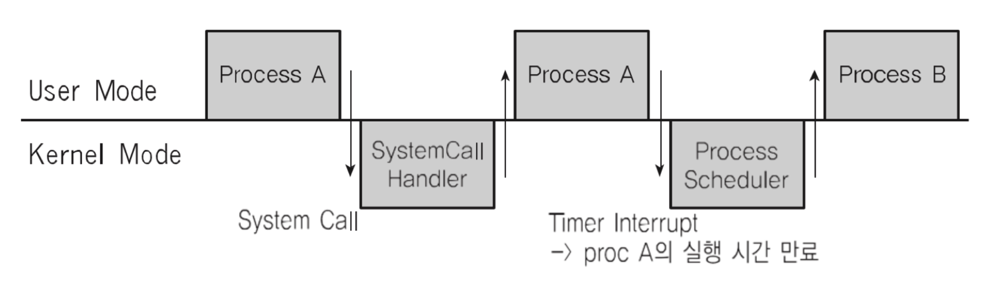

# 스케쥴링 알고리즘 기본
#### 프로세스란?
* 메모리에 올려져서, 실행 중인 프로그램
	* 코드 이미지(바이너리): 실행 파일. Ex) ELF Format
* 응용 프로그램 != 프로세스
	* 하나의 응용 프로그램은 여러 개의 프로세스(프로그램)가 상호작용하면서 실행될 수 있다.
	* 여러 프로그램을 만들어서, 서로 통신하면서 플호그램을 작성할 수 있다.(IPC 기법)

#### 스케쥴러
* 프로세스의 실행을 관리

- - - -

## FIFO 스케쥴러
* 가장 간단한 스케쥴러 (배치 처리 시스템)
* FCFS (First Come First Served) 스케쥴러 

- - - -

## 최단 작업 우선(SJF) 스케쥴러
* SFJ(Shortest Job First) 스케쥴러
* 가장 실행 시간이 짧은 프로세스부터 먼저 실행시키는 알고리즘

- - - -

## 우선순위 기반(Priority-Based) 스케쥴러
* 정적 우선순위 : 프로세스마다 우선순위를 미리 지정
* 동적 우선순위 : 스케쥴러가 상황에 따라 우선순위를 동적으로 변경

- - - -

## Round Robin 스케쥴러
* 시분할 시스템 기반

---

> RealTile OS(RTOS) : 응용 프로그램 실시간 성능 보장을 목표로 하는 OS  
> - 프로그램 시작/완료 시간을 보장  
> - 시간에 민감한 프로세스들이 동작해야하는 상황에서 사용  
> - Hardware RTOS, Software RTOS  

> General Purpose OS (GPOS)  
> - 프로세스 실행시간에 민감하지 않고, 일반적인 목적으로 사용되는 OS  
> Ex) Windows, Linux 등 ..  
