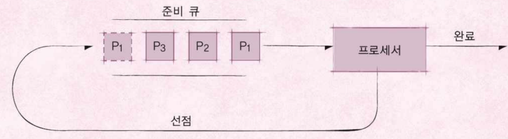
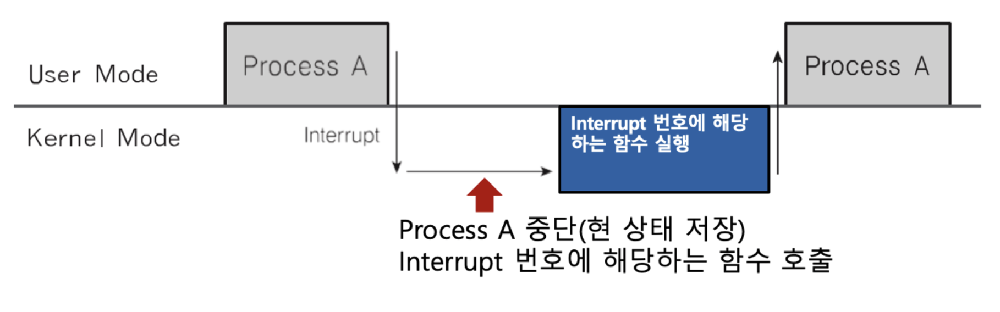

# 인터럽트

## 인터럽트란
* CPU가 프로그램을 실행하고 있을 때, 입출력 하드웨어 등의 장치 혹은 예외상황이 발생하여 처리가 필요한 경우에 CPU에 알려서 처리하는 기술

<br />

## 인터럽트가 필요한 이유
* 선점형 스케쥴러 구현
  * 프로세스 running 중에 스케쥴러가 이를 중단시키고, 다른 프로세스로 교체하기 위해 현재 프로세스를 중단시킨다. 그러기 위해서는, 스케쥴러 코드가 실행되어 현 프로세스 실행을 중단시켜야 한다.
* IO Device와의 커뮤니케이션
  * 저장매체에서 데이터 처리 완료시, 프로세스를 깨워야 한다. (block state → ready state)
* 예외 상황 핸들링
  * CPU가 프로그램을 실행하고 있을 때, 입출력 하드웨어 등의 장치나 또는 예외상황이 발생한 경우, CPU가 해당 처리를 할 수 있도록 CPU에 알려줘야 한다.

<br />

## 인터럽트 처리 예
* CPU가 프로그램을 실행하고 있을 때, 입출력 하드웨어드  등의 장치 이슈 발생
  * Ex) 파일 처리가 끝났다는 것을 운영체제에 알려주기 → 운영체제는 해당 프로세스를 block state에서 실행 대기(ready) 상태로 프로세스 상태 변경
* CPU가 프로그램을 실행하고 있을 때, 예외 상황이 발생
  * Ex) 0으로 나누는 게산이 발생, 예외 상황을 운영체제에 알려주기 → 운영체제가 해당 프로세스 실행 중지/에러 표시

<br />

## 이벤트와 인터럽트
* 인터럽트는 일종의 이벤트라고 불린다.
* 이벤트에 맞게 운영체제가 처리한다.

<br />

## 주요 인터럽트 (Interrupt)
1. Divide-by-Zero Interrupt
   * 계산하는 코드에서 0으로 나누는 코드 실행 시
2. 타이머 인터럽트
   * 하드웨어로 부터 일정 시간마다 타이머 인터럽트를 운영체제에 알려준다.
   * 선점형 스케쥴러를 위해 필요하다.
3. 입출력(IO) 인터럽트
   * Ex) 프린터, 키보드, 마우스, 저장매체 (SSD 등)

<br />

## 인터럽트 종류
#### 내부 인터럽트
* 소프트웨어 인터럽트라고도 한다.
* 주로 프로그램 내부에서 잘못된 명렁 또는 잘못된 데이터 사용 시 발생 (예외상황)
  * 0으로 나누었을 경우
  * 사용자 모드에서 허용되지 않은 명령 또는 공간 접근 시
  * 계산 결과가 Overflow/Underflow 날 경우

#### 외부 인터럽트
* 하드웨어 인터럽트라고도 한다.
* 주로 하드웨어에서 발생하는 이벤트 (프로그램 외부)
  * 전원 이상
  * 기계 문제
  * 키보드 등 IO 관련 이벤트
  * Timer 이벤트

<br />

## 시스템 콜 인터럽트
* 시스템 콜 실행을 위해서는 강제로 코드에 인터럽트 명령을 넣어, CPU에 실행시켜야 한다.

#### 시스템 콜 실제 코드
```
mov eax, [시스템 콜 번호]
mov ebx, [인자 값]
int [op code, 시스템 콜: 0x80 고정]
```
* eax 레지스터어 시스템 콜 번호를 넣는다.
* ebx 레지스터에는 시스템 콜에 해당하는 인자값을 넣는다.
* 스프트웨어 인터럽트 명령을 호출하면서 0x80 값을 넘겨준다.
  1. CPU는 사용자 모드를 커널 모드로 바꿔준다.
  2. IDT(Interrupt Descriptor Table)에서 0x80에 해당하는 주소(함수)를 찾아서 실행한다.
  3. system_call() 함수에서 eax로부터 시스템 콜 번호를 찾아서, 해당 번호에 맞는 시스템콜 함수로 이동한다.
  4. 해당 시스템 콜 함수 실행 후, 다시 커널 모드에서 사용자 모드로 변경하고, 다시 해당 프로세스 다음 코드를 진행한다.


<br />

## 사용자/커널 모드와 프로세스, 인터럽트



<br />

## 인터럽트와 IDT

#### IDT(Interrupt Descriptor Table)
* 인터럽트 각각 번호와 실행 코드(운영체제 내부 코드)를 가리키는 주소가 기록되어 있다.
* 컴퓨터 부팅 시 운영체제가 기록한다.
* IDT에는 0x80 → system_call() 와 같은 정보가 기록되어 있다.

#### 리눅스 예
* 0 ~ 31 : 예외 상황 인터럽트 (일부는 정의안된 채로 남겨져 있다.)
* 32 ~ 47 : 하드웨어 인터럽트 (주변 장치 종류/갯수에 따라 변경 가능)
* 128 : 시스템 콜

<br />

## 인터럽트와 프로세스
1. 프로세스 실행 중 인터럽트 발생
2. 현재 실행 중인 프로세스 중단
3. 인터럽트 처리 함수 실행 (운영체제, 커널모드)
4. 실행 중이던 현 프로세스 재실행


