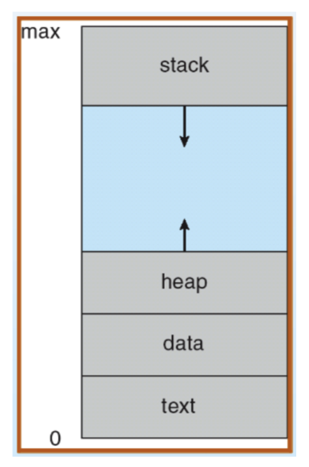
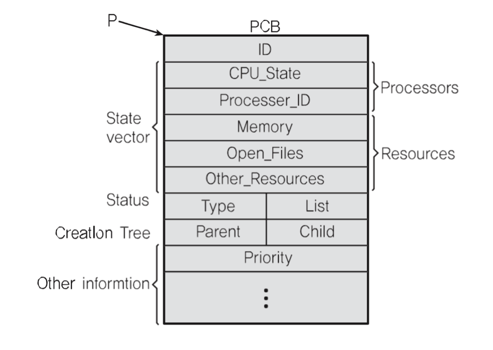

# 프로세스 상태와 스케쥴링

## 멀티 프로그램밍과 Wait
* 멀티 프로그랴밍: CPU 활용도를 극대화하는 스케쥴링 알고리즘

> Wait: 간단히 저장매체로부터 파일 읽기를 기다리는 시간으로 지정  

## 프로세스 상태

* running state: 현재 CPU에서 실행 상태
* ready state: CPU에서 실행 가능 상태 (실행 대기 상태)
* block state: 특정 이벤트 발생 대기 상태

## 프로세스 상태 간 관계
* ready, running, block states

1. Process blocks for input
2. Scheduler picks another process
3. Scheduler picks this process
4. Process becomes available
