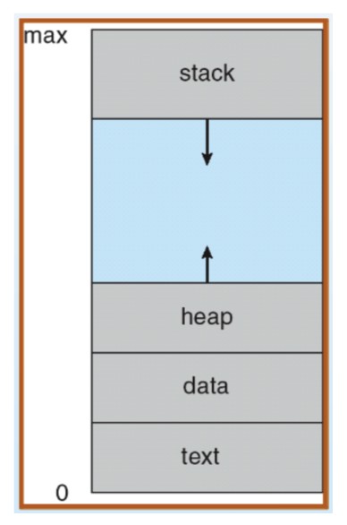
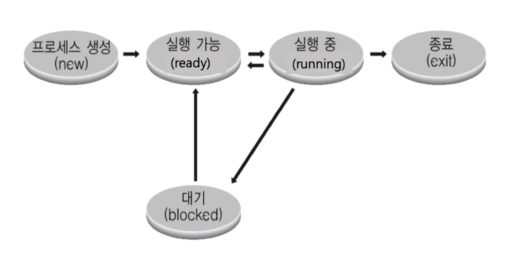

# 프로세스 컨텍스트 스위칭
 
 ## 프로세스 구조
 * CODE(text): 컴파일 된 소스 코드 
 * DATA: 변수/초기화된 데이터
 * STACK: 임시 데이터 (함수 호출, 로컬 별수 등)
 * HEAP: 코드에서 동적으로 만들어지는 데이터

 

## 프로세스 구조와 컴퓨터 구조
* PC (Program Counter)
* SP (Stack Pointer)
* EBP : 함수가 호출된 최상단 Stack Pointer
  * 다음 주소는 함수 return address 

 

## PCB
* Progress Control Block, Process Context Block
* 프로세스가 실행 중인 상태를 캡쳐/구조화해서 저장
  * Process ID
  * Register 값 (PC, SP 등 ...)
  * Scheduling Info (Process State)
  * Memory Info (메모리 사이즈 limit)

#### PCB:리눅스 예

 

## 컨텍스트 스위칭 (Context Switching, 문맥 교환)
* CPU에 실행할 프로세스를 교체하는 기술

1. 실행 중지할 프로세스 정보를 해당 프로세스의 PCB에 업데이트해서, 메인 메모리에 저장
2. 다음 실행할 프로세스 정보를 메인 메모리에 있는 해당 PCB 정보(PC, SP)를 CPU의 레지스터에 넣고 실행

> 디스패치 (dispatch) : ready 상태의 프로세스를 running 상태로 바꾸는 것

