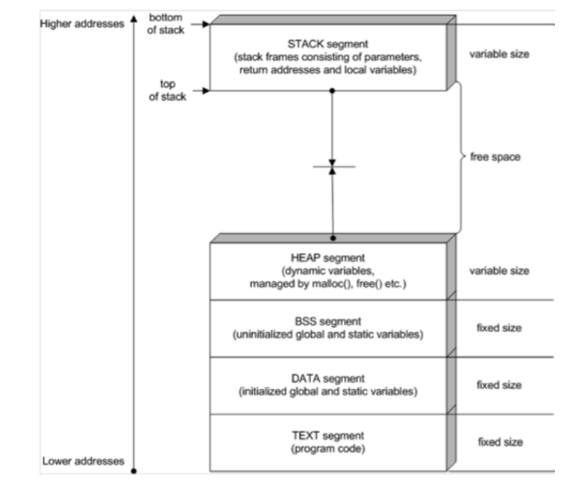
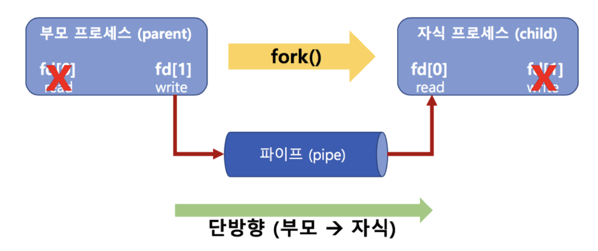
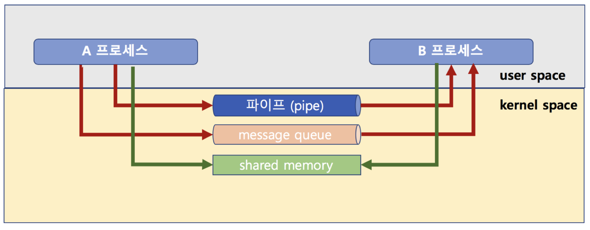
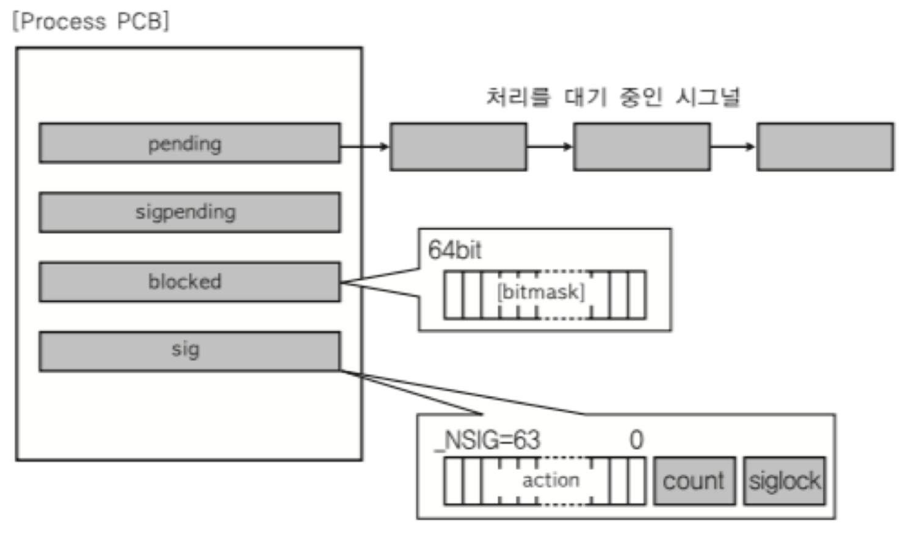
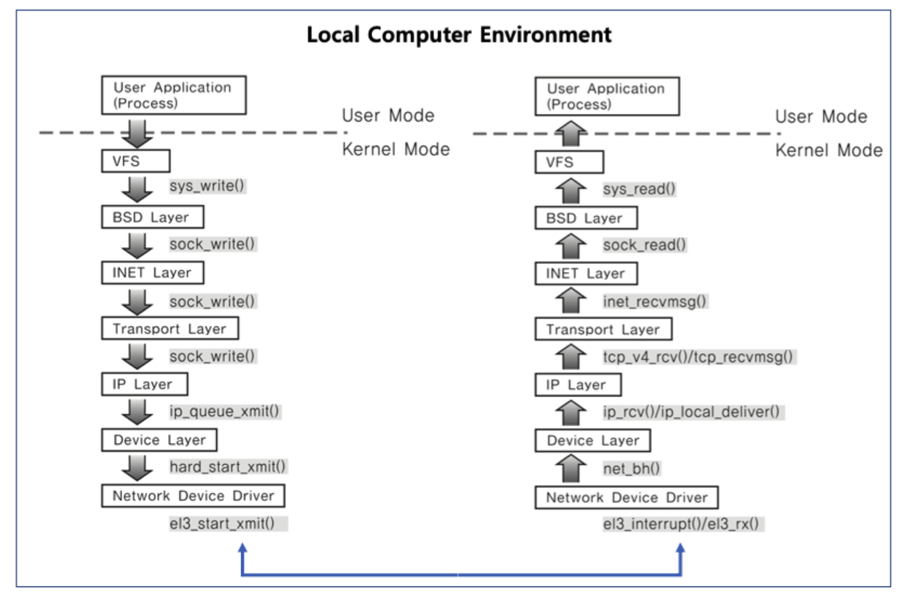
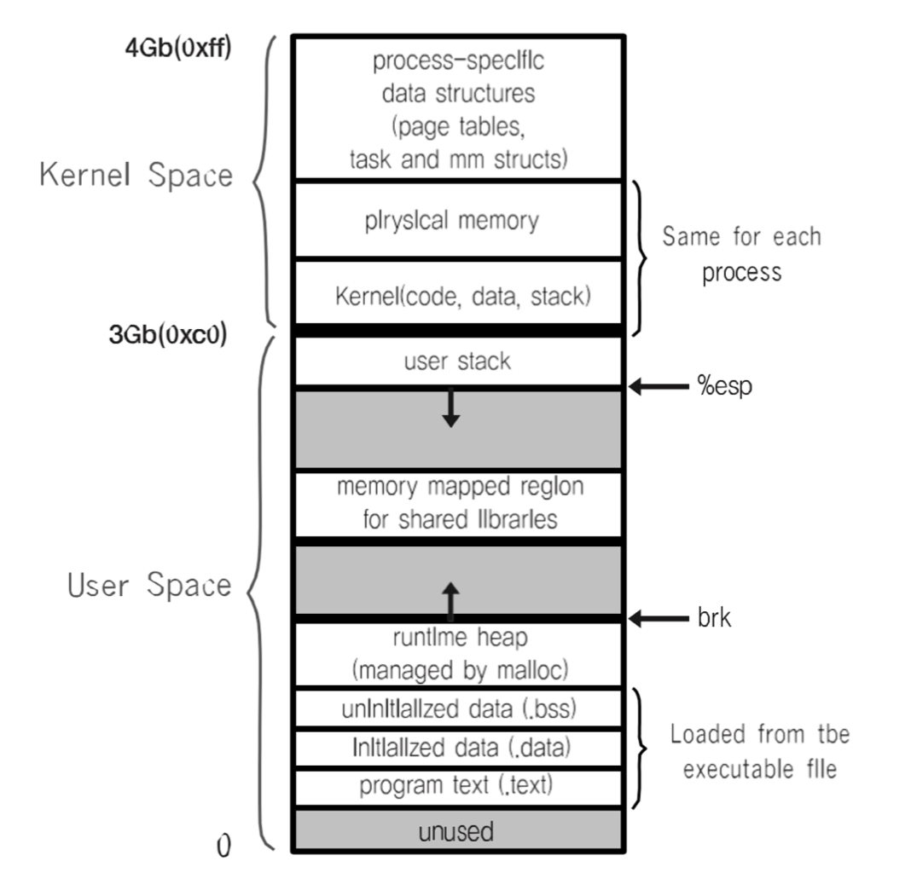

# 프로세스간 커뮤니케이션

* 프로세스는 다른 프로세스의 공간을 접근할 수 없다.
* 성능을 높이기 위하여 여러 프로세스를 만들어 동시 실행할 때, 프로세스간 상태 확인 및 데이터 송수신이 필요하다.

 

## IPC (InterProcess Communication)
* 프로세스간 통신 방법을 재공한다.

1. file 사용
    * 실시간으로 직접 원하는 프로세스에 데이터 전달이 어렵다.
2. Message Queue
3. Shared Memory
4. Pipe
5. Signal
6. Semaphore
7. Socket
...

* 2번부터는 모두 커널 공간을 사용한다. 어떻게 사용하는 지가 다른 것이다.

#### 파이프
* 기본 파이프는 단방향 통신
* fork()로 자식 프로세스 만들었을 때, 부모와 자식간의 통신

 

#### 메세지 큐 (message Queue)
* 기본적으로 FIFO 정책으로 데이터 전송 (먼저 넣은 데이터가 먼저 읽혀진다.)
* 부모/자식이 아니라, 어느 프로세스간에라도 데이터 송수신이 가능하다.
* 양방향이 가능하다.

 

#### 공유 메모리 (shared memory)
* 노골적으로 kernel space에 메모리 공간을 만드록, 해당 공간을 변수처럼 쓰는 방식
* message Queue처럼 FIFO 방식이 아니라, 해당 메모리 주소를 마치 변수처럼 접근하는 방식이다.
* 공유메모리 key를 가지고 여러 프로세스가 접근이 가능하다.

> 메모리 공간도 kernel/user로 구분된다.

 

####  시그널 (Signal)
* 유닉스에서 30년이상 사용된 전통적인 기법
* 커널 또는 프로세스에서 다른 프로세스에 어떤 이벤트가 발생되었는지를 알려주는 기법
* 프로세스 관련 코드에 관련 시그널 핸들러를 등록해서, 해당 시그널 처리 실행
    1. 시그널 무시
    2. 시그널 블록(블록을 푸는 수간, 프로세스에 해당 시그널 전달)
    3. 등록된 시그널 핸들러로 특정 동작 수행
    4. 등록된 시그널 핸들러가 없다면, 커널에서 기본 동작 수행
* PCB에 해당 프로세스가 블록 또는 처리해야하는 시그널 관련 정보를 관리한다.

##### 주요 시그널 
* SIGKILL: 프로세스를 죽여라 (슈퍼관리자가 사용하는 시그널, 프로세스는 어떤 경우든 죽도록 되어있다.)
* SIGALARM: 알람을 발생한다.
* SIGSTP: 프로레스를 멈춰라(Ctrl + z)
* SIGCONT: 멈춰진 프로세스를 실행해라
* SIGINT: 프로세스에 인터럽트를 보내서 프로세스를 죽여라 (Ctrl + c)
* SIGSEGV: 프로세스가 다른 메모리 영역을 침범했다.

 

#### 소켓(socket)
* 소켓은 네트워크 통신을 위한 기술이다.
* 기본적으로는 클라이언트와 서버 등 두 개의 다른 컴퓨터간의 네트워크 기반 통신을 위한 기술이다.
* 소켓을 하나의 컴퓨터 안에서, 두 개의 프로세스간에 통신 기법으로 사용가능하다.

 

## 실제 리눅스 예

* 프로세스간 공간은 완전히 분리되어 있다.
* 커널 공간은 공유한다.