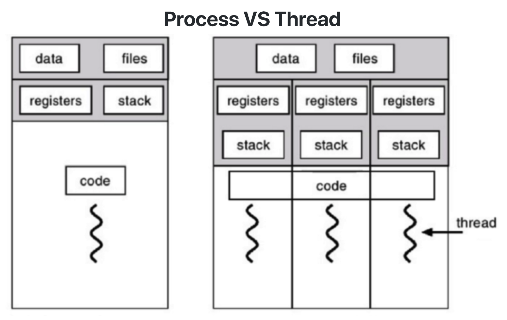
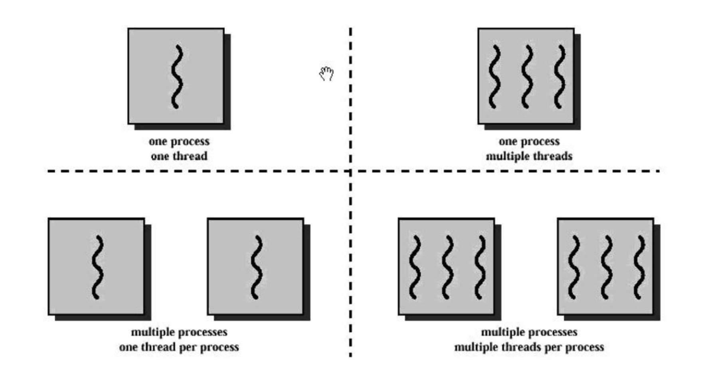
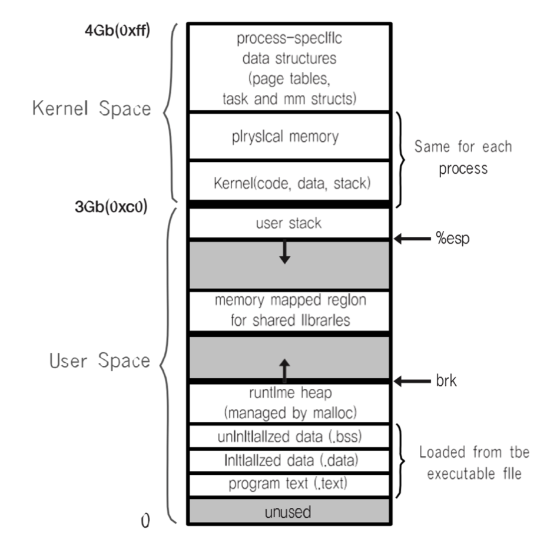
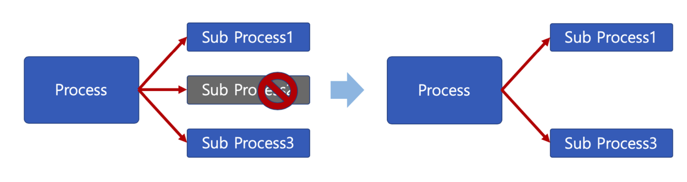
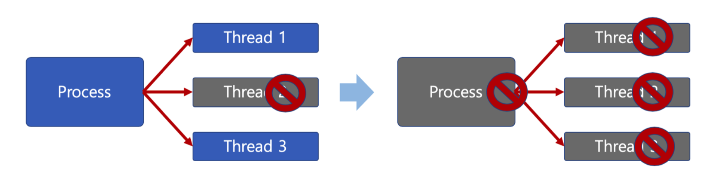
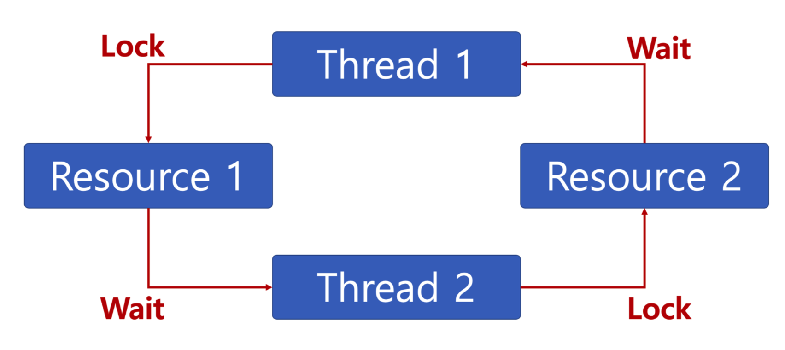

# Thread

## Thread (쓰레드)
* Light Weight Process 라고도 한다.
* 하나의 프로세스에 여러 개의 스레드 생성이 가능하다.
* 스레드들은 동시에 실행이 가능하다.
* 프로세스 안에 있어, 프로세스의 데이터를 모두 접근이 가능하다. (프로세스와 같이 IPC를 사용할 필요가 없다.)
* **각기 실행이 가능한 Stack이 존재한다.**



<br />

## Multi Thread (멀티 스레드)
* 소프트웨어 병행 작업 처리를 위해 Multi Thread를 사용한다.


<br />

## 멀티 프로세스와 멀티 태스킹



> 최근 CPU는 멀티 코어를 가지므로, Thread를 여러 개 만들어 멀티 코어의 활용도를 높인다.

<br />

## Thread의 장점
1. 사용자에 대한 응답성 향상


2. 자원 공유 효율
    * IPC 기법과 같이 프로세스간 자원 공유를 위해 번거로운 작업이 필요없다.
    * 프로세스 안에 있으므로, 프로세스의 데이터를 모두 접근 가능하다.



3. 작업이 분리되어 코드가 간결해질 수 있다.

<br />

## Thread의 단점
* 스레드 중 한 스레드만 문제가 있어도, 전체 프로세스가 영향을 받는다.
   * 멀티 프로세스
   
   * 멀티 스레드
   
    
* 스레드를 많이 생성하면, Context Switching 이 많이 일어나, 성능 저하가 발생할 수 있다.
  * Ex) 리눅스 OS에서는 Thread를 Process와 같이 다뤄 스레드를 많이 생성하면, 모든 스레드를 스케쥴링해야 하므로 Context Switching이 빈번할 수 밖에 없다.

<br />

## Thread vs Process
* 프로세스는 독립적, 스레드는 프로세스의 서브셋
* 프로세스는 각각 독립적인 자원을 가지나, 스레드는 프로세스 자원을 공유한다.
* 프로세스는 자신만의 주소 영역을 가지나, 스레드는 주소 영역을 공유한다.
* 프로세스 간에는 IPC 기법으로 통신해야 하나, 스레드는 필요 없다.

<br />

## PThread
* POSIX 스레드 (POSIX Threads)
* Thread 관련 표준 API

<br />

## 동기화(Synchronization) 이슈
* 여러 스레드가 동일한 자원(데이터) 접근 시 동기화 이슈가 발생한다.
* 동일 자원을 여러 스레드가 동시 수정시, 각 스레드 결과에 영향을 준다.

> 동기화: 작업들 사이에 실행 시기를 맞추는 것

<br />

## 동기화 이슈 해결 방안

#### Mutual exclusion (상호 배제)
* 어느 한 스레드가 공유 변수를 갱신하는 동안 다른 스레드가 동시 접근하지 못하도록 막는다.

* 임계 자원(critical resource)
  * g_count 변수
* 임계 영역(critical section)
  * lock.acquire() ~ lock.release() 영역

```python
lock.acquire()
for i in range(100000):
    g_count += 1
lock.release()
```

<br />

## Mutex와 세마포어 (Semaphore)
* Critical Section(임계 구역)에 대한 적급을 막기 위해 LOCKING 매커니즘이 필요하다.

* Mutex(binary semaphore)
  * 임계 구역에 하나의 스레드만 들어갈 수 있다.
* Semaphore
  * 임계 구역에 여러 쓰레드가 들어갈 수 있다.
  * counter를 두어서 동시에 리소스에 접근할 수 있는 허용 가능한 스레드 수를 제어한다.

#### 세마포어 (Semaphore)
* P: 검사 (임계 영역에 들어갈 때)
  * S값이 1 이상이면, 임계 영역 진입 후, S값 1 차감 (S값이 0이면 대기)
* V: 증가 (임계 영역에 나올 때)
  * S값을 1 더하고, 임계 영역을 나온다.
* S: 세마포어 값 (초기 값만큼 여러 프로세스가 동시 임계 영역 접근 가능하다.)

```c
P(S): wait(S) {
    while s <= 0 // 대기
    ;
    S--; // 다른 프로세스 접근 제한
}
```

```c
V(S): signal(S) {
    S++; // 다른 프로세스 접근 허용
}
```

<br />

#### 세마포어 (Semaphore) - 바쁜 대기
* wait()은 S가 0이라면, 임계 영역에 들어가기 위해 반복문을 수행한다.
* 바쁜 대기, busy waiting

```c
P(S): wait(S) {
    while S <= 0 // 바쁜 대기
    ;
    S--; // 다른 프로세스 접근 제한
}
```

* 끊임없이 코드 실행 → loop는 CPU에 부하를 걸리게 한다.

<br />

#### 세마포어 (Semaphore) - 대기큐
> 운영체제 기술로 보안 - 대기큐
* S가 음수일 경우, 바쁜 대기 대신 대기 큐에 넣는다.

```c
wait(S) {
    S->count--;
    if (S->count <= 0) {
        add this process to S->queue;
        block();
    }
}
```

* wakeup() 함수를 통해 대기큐에 있는 프로세스 재실행

```c
signal(S) {
    S->count ++;
    if (S->count > 0) {
        remove a process P from S->queue;
        wakeup(P);
    }
}
```

<br />

#### 주요 세마포어 함수 (POSIX 세마포어)
* sem_open() : 세마포어 생성
* sem_wait() : 임계영역 접근 전 세마포어를 잠그고, 세마포어가 잠겨있다면 풀릴 때까지 대기한다.
* sem_post() : 공유 자원에 대한 접근이 끝났을 때 세마포어 잠금을 해제한다.

<br />

## 교착상태 (deadlock)
* 무한 대기 상태: 두 개 이상의 작업이 서로 상대방의 작업이 끝나기만을 기다리고 있기 때문에, 다음 단계로 진행하지 못하는 상태



> 배치 처리 시스템에서는 일어나지 않는 문제이다.
> 프로세스, 스레드 둘 다 이와 같은 상태가 일어날 수 있다.

#### 교착상태 발생 조건
* 다음 네 가지 조건이 모두 성립될 때, 교착 상태 발생 가능성이 있다.
1. 상호배제 (Mutual exclusion): 프로세스들이 필요로 하는 자원에 대해 배타적인 통제권을 요구한다.
2. 점유대기 (Hold and wait): 프로세스가 할당된 자원을 가진 상테에서 다른 자원을 기다린다.
3. 비선점 (No preemption): 프로세스가 어떤 자원의 사용을 끝날 때까지 그 자원을 뺏을 수 없다.
4. 순환대기 (Circular wait): 각 프로세스는 순환적으로 다음 프로세스가 요구하는 자원을 가지고 있다.

#### 교착 상태 해결 방법
1. 교착상태 예방
2. 교착상태 회피
3. 교착상태 발견
4. 교착상태 회복

<br />

## 기아상태 (starvation)
* 특정 프로세스의 우선순위가 낮아서 원하는 자원을 계속 할당 받지 못하는 상태
* 여러 프로세스가 부족한 자원을 점유하기 위해 경쟁할 때, 특정 프로세스는 영원히 자원이 할당이 안되는 경우를 주로 의미한다.

#### 기아상태 해결 방안
* 우선 순위 변경
  * 프로세스 우선순위를 수시로 변경해서, 각 프로세스가 높은 우선순위를 가질 기회 주기.
  * 오랜 기다린 프로세스의 우선순위를 높여준다.
  * 우선순위가 아닌, 요청 순서대로 처리하는 FIFO 기반 요청큐를 사용한다.

