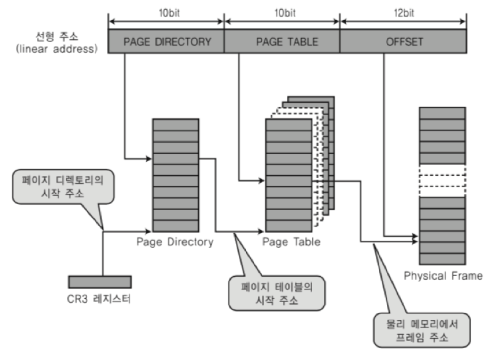
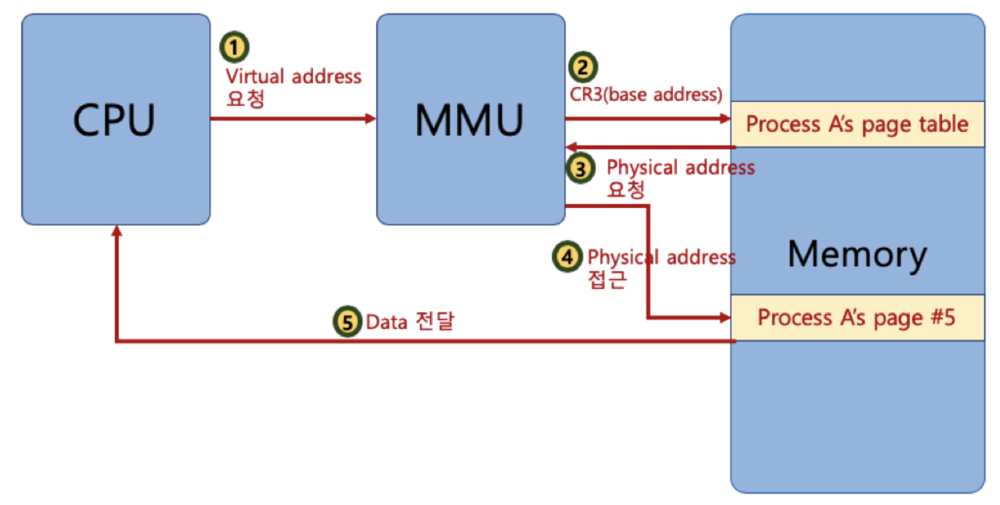
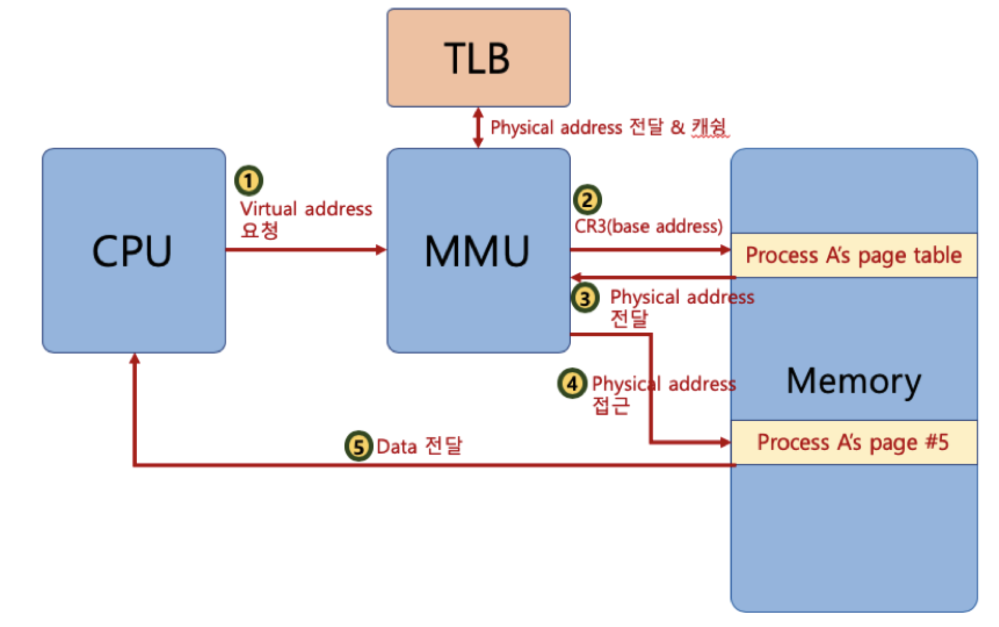
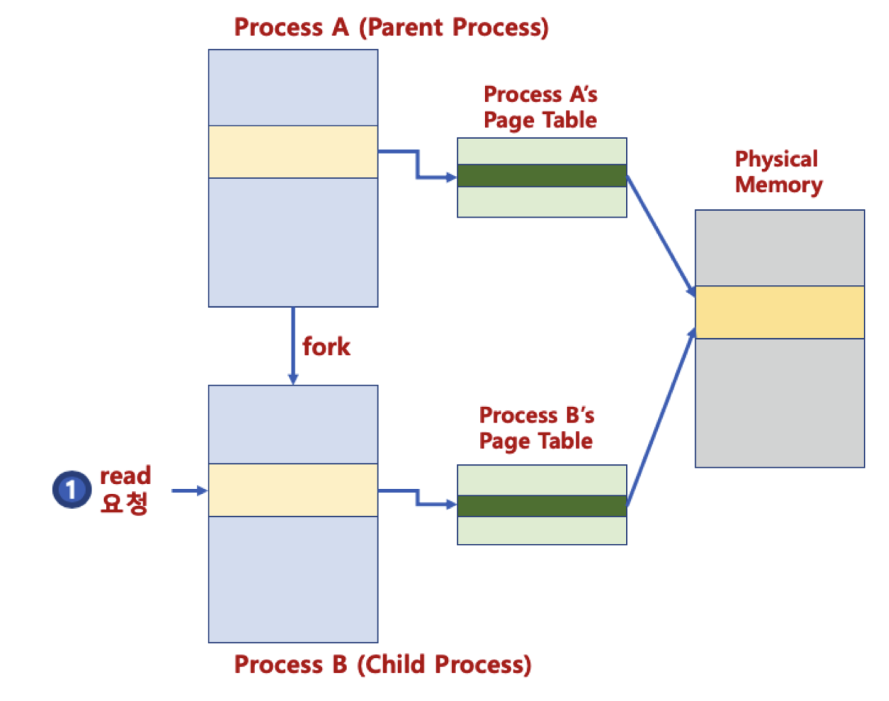
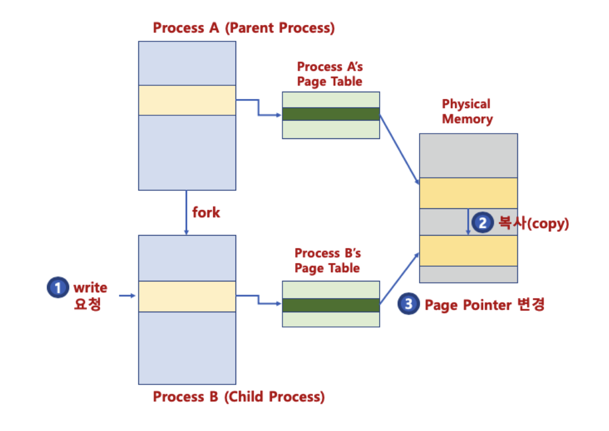
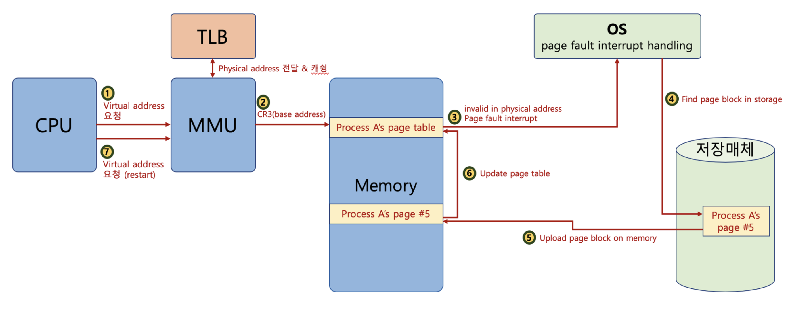
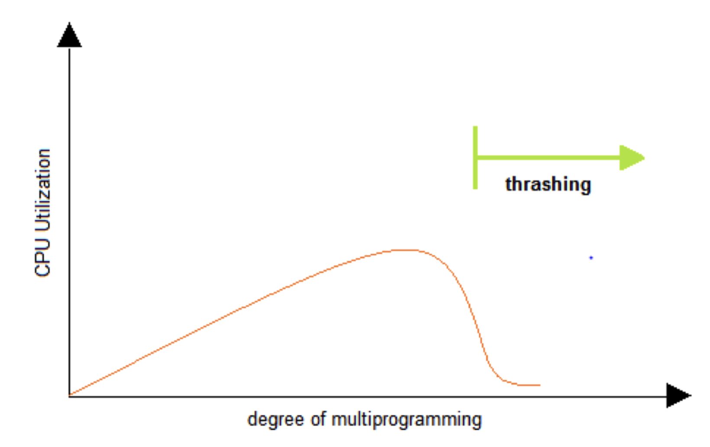
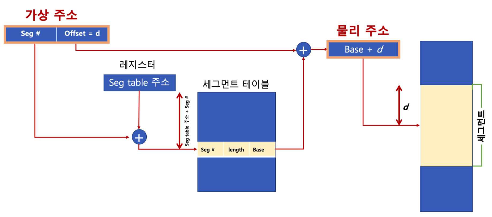
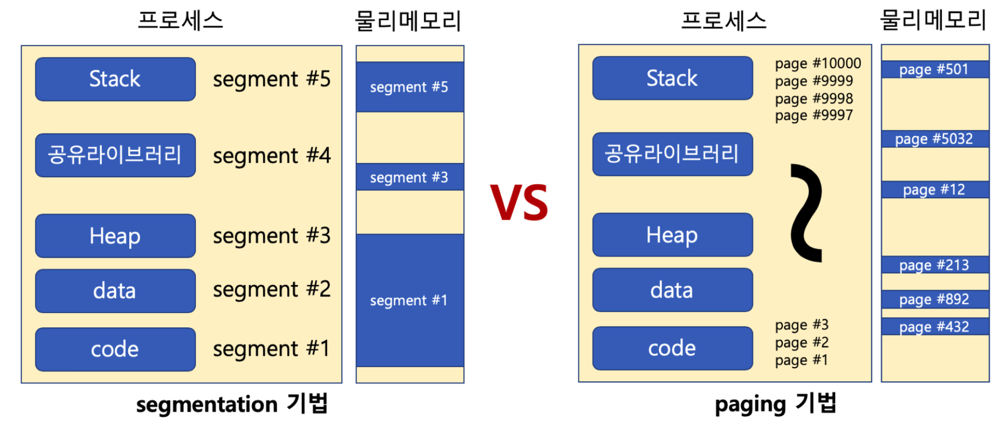

# 페이징 시스템

## 페이징 시스템(paging system)
* 크기가 동일한 페이지로 가상 주소 공간과 이에 매칭하는 물리 주소 공간을 관리한다.
* 하드웨어 지원이 필요하다.
  * Intel x86 시스템(32bit) 에서는 4KB, 2MB, 1GM 지원
  * 리눅스에서는 4KB로 paging 한다.
* 페이지 번호를 기반으로 가상 주소/물리 주소 매핑 정보를 기록/사용한다.
* 프로세스(4GB)의 PCB에 Page Table 구조체를 가리키는 주소가 들어가 있다.
* **Page Table**에는 가상 주소와 물리 주소간 매핑 정보가 있다.

 

#### 페이징 시스템 구조
* page 또는 page frame : 고정된 크기의 block (4KB)
* paging system
  * 가장 주소 v = (p, d)
  * p: 가상 메모리 페이지
  * d: p 안에서 참조하는 위치
  

* Ex) 페이지 크기가 4KB인 경우
  * 가상 주소의 0비트~11비트가 변위(d)를 나타내고, 12비트 이상이 페이지 번호가 될 수 있다.

 

#### 페이지 테이블 (page table)
* 물리 주소에 있는 페이지 번호와 해당 페이지의 첫 물리 주소 정보를 매핑한 표
* 가상 주소 v = (p, d)라면
  * p: 페이지 번호
  * d: 페이지 처음부터 얼마 떨어진 위치인지

 

#### 페이징 시스템 동작

1. 해당 프로세스에서 특정 가상 주소 엑세를 하려면, 해당 프로세스의 page table에 해당 가상 주소가 포함된 Page 번호가 있는 지 확인한다.
2. page 번호가 있으면, page가 매핑된 첫 물리 주소를 알아낸다.
3. 첫 물리 주소 + d  가 실제 물리 주소가 된다.

 

#### 페이징 시스템과 MMU (컴퓨터 구조)
* CPU는 가상 주소 접근 시, MMU 하드웨어 장치를 통해 물리 메모리에 접근한다.

* 프로세스 생성 시, 페이지 테이블 정보를 생성한다.
* PCB 등에서 해당 페이지 테이블에 접근이 가능하고, 관련 정보는 물리 메모리에 적재된다.
* 프로세스 구동 시, 해당 페이지 테이블의 base 주소가 별도 레지스터에 저장된다. (CR3)
* CPU가 가상 주소 접근 시, MMU가 페이지 테이블 base 주소를 접근해서, 물리 주소를 가져온다.

 

## 다중 단계 페이징 시스템
* 페이징 정보를 단계를 나누어 실행한다.
* 필요없는 페이지는 생성하지 않으면, 공간 절약이 가능하다.

* 페이지 번호를 나타내는 bit를 구분해서, 단계를 나눈다. (리눅스는 3단계, 최근 4단계)

 

## MMU와 TLB(컴퓨터 구조)

* MMU가 물리 주소를 확인하기 위해, 매번 메모리를 갔다와야 한다.

* **TLB** (Translation Lookaside Buffer): 페이지 정보 캐쉬

 

## 페이징 시스템과 공유 메모리
* 프로세스 간 동일한 물리 주소를 가리킬 수 있다. → 공간 절약, 메모리 할당 시간 절약
  

* 물리 주소에 데이터 수정 시도 시, 물리 주소를 복사할 수 있다. (copy-on-write)
  

 

## 요구 페이징 (Demand Paging / Demanded Paging)
* 프로세스 모든 데이터를 메모리로 적재하지 않고, 실행 중 필요한 시점에서만 메모리로 적재한다.
* 선행 페이징(anticipatory paging / prepaging)의 반대 개념이다.
  * 미리 프로세스 관련 모든 데이터를 메모리에 올려놓고 실행하는 기법
* 더 이상 필요하지 않은 페이지 프레임은 다시 저장 매체에 저장한다. (**페이지 교체 알고리즘 필요**)

 

## 페이지 폴트
* 어떤 페이지가 실제 물리 메모리에 없을 때 나타나는 인터럽트
* 운영체제가 page fault가 일어나면, 해당 페이지를 물리 메모리에 올린다.
* 페이지 폴트가 자주 일어나게 되면, 실행하기 전 해당 페이지를 물리 메모리에 올려야 하기 때문에 시간이 오래 걸린다.

##### 페이지 폴트와 인터럽트

 

## 페이지 교체 정책 (page replacement policy)
* 운영체제가 특정 페이지를 물리 메모리에 올리려고 하는데, 물리 메모리가 다 차있는 경우 기존 페이지 중 하나를 물리 메모리에서 저장 매체로 내리고(저장), 새로운 페이지를 해당 물리 메모리 공간에 올린다.

### 페이지 교체 알고리즘

#### FIFO (First In First Out)
* 가장 먼저 들어온 페이지를 내린다.

 

#### OPT (최적 페이지 알고리즘, OPTime)
* 앞으로 가장 오랫동안 사용하지 않을 페이지를 내린다.
* 일반 OS에서는 구현이 불가능하다.

 

#### LRU (Least Recently Used) 
* 가장 오래 전에 사용 된 페이지를 교체한다.
* OPT 교체 알고리즘 구현이 불가능하므로, 과거 기록을 기반으로 시도하는 알고리즘.

 

#### LFU (Least Frequently Used)
* 가장 적게 사용된 페이지를 내리자.

 

#### NUR (Not Used Recently)
* 최근에 사용하지 않은 페이지부터 교체하는 기법
* 각 페이지마다 참조 비트(R), 수정 비트(M)을 둔다. (R, M)
  * (0, 0), (0, 1), (1, 0), (1, 1) 순으로 페이지를 교체한다.

 

## 스레싱 (Thrashing)
* 반복적으로 페이지 폴트가 발생하여, 과도하게 페이지 교체 작업이 일어나 실제로는 아무일도 못하는 상황

 

## 세그멘테이션 기법
* 가상 메모리를 서로 크기가 다른 논리적 단위인 세그먼트(Segment)로 분할한다.
  * 페이징 기법에서는 가상 메모리를 같은 크기의 불록으로 분할한다.

* 세그먼트 가상 주소 : v = (s, d)
  * s: 세그먼트 번호
  * d: 블록 내 세그먼트의 변위

* 세그멘테이션은 크기가 다른 semgent 단위로 물리 메모리에 로딩한다.

#### 내부 단편화 (페이지 기법)
* 페이지 블록만큼 데이터가 딱 맞게 채워져있지 않을 때 공간 낭비가 되는 경우

#### 외부 단편화 (세그멘테이션 기법)
* 물리 메모리가 원하는 연속된 크기의 메모리를 제공해주지 못하는 경우

#### 세그멘테이션/페이징 모두 하드웨어 지원이 필요하다.
* 다양한 컴퓨터 시스템에 이식성을 중요시하는 리눅스는 페이징 기법을 기반으로 구현되어 있다.
