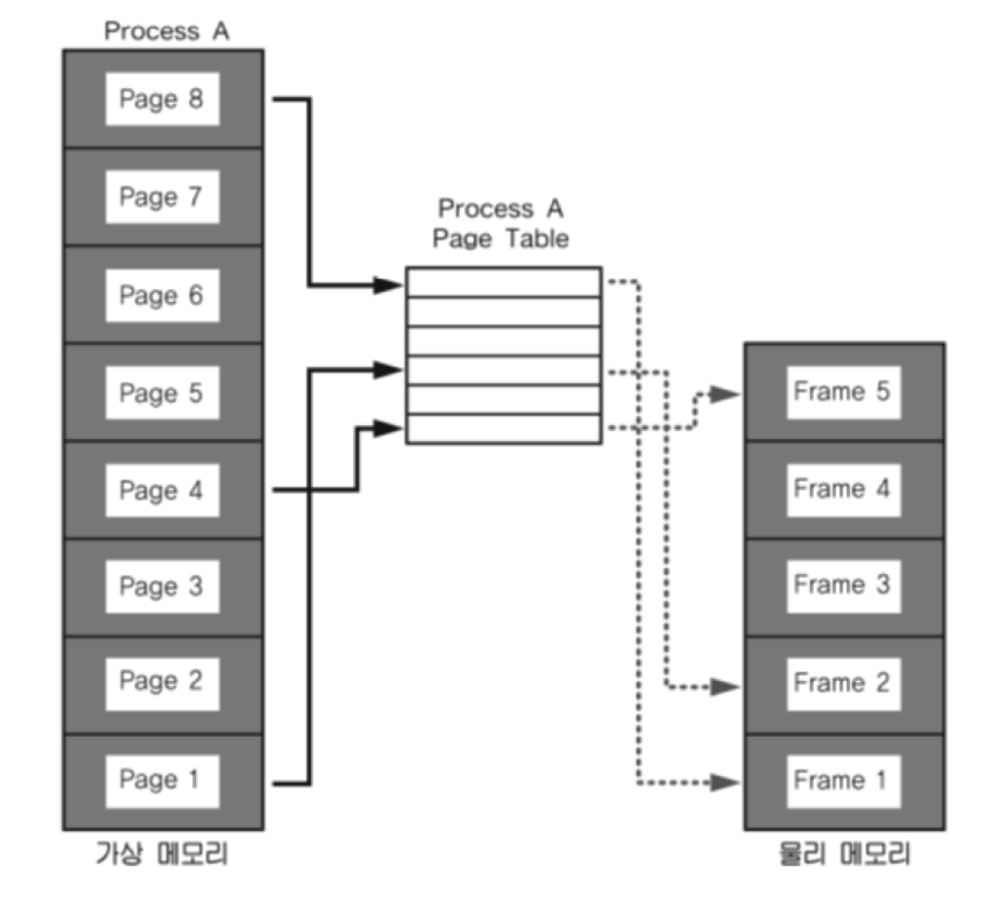
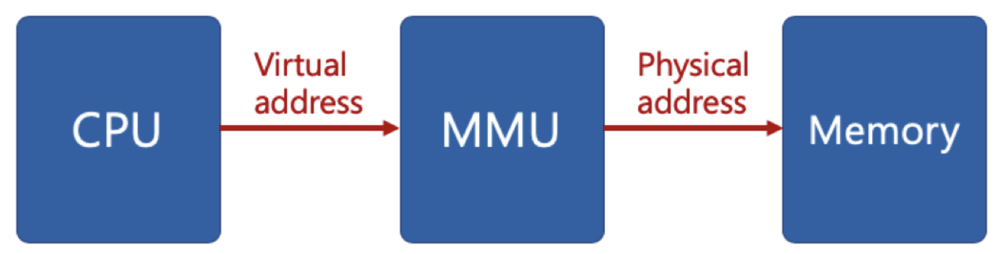

# 페이징 시스템

## 페이징 시스템(paging system)
* 크기가 동일한 페이지로 가상 주소 공간과 이에 매칭하는 물리 주소 공간을 관리한다.
* 하드웨어 지원이 필요하다.
  * Intel x86 시스템(32bit) 에서는 4KB, 2MB, 1GM 지원
  * 리눅스에서는 4KB로 paging 한다.
* 페이지 번호를 기반으로 가상 주소/물리 주소 매핑 정보를 기록/사용한다.
* 프로세스(4GB)의 PCB에 Page Table 구조체를 가리키는 주소가 들어가 있다.
* **Page Table**에는 가상 주소와 물리 주소간 매핑 정보가 있다.

 

#### 페이징 시스템 구조
* page 또는 page frame : 고정된 크기의 block (4KB)
* paging system
  * 가장 주소 v = (p, d)
  * p: 가상 메모리 페이지
  * d: p 안에서 참조하는 위치
  

* Ex) 페이지 크기가 4KB인 경우
  * 가상 주소의 0비트~11비트가 변위(d)를 나타내고, 12비트 이상이 페이지 번호가 될 수 있다.

 

#### 페이지 테이블 (page table)
* 물리 주소에 있는 페이지 번호와 해당 페이지의 첫 물리 주소 정보를 매핑한 표
* 가상 주소 v = (p, d)라면
  * p: 페이지 번호
  * d: 페이지 처음부터 얼마 떨어진 위치인지

 

#### 페이징 시스템 동작

1. 해당 프로세스에서 특정 가상 주소 엑세를 하려면, 해당 프로세스의 page table에 해당 가상 주소가 포함된 Page 번호가 있는 지 확인한다.
2. page 번호가 있으면, page가 매핑된 첫 물리 주소를 알아낸다.
3. 첫 물리 주소 + d  가 실제 물리 주소가 된다.

 

#### 페이징 시스템과 MMU (컴퓨터 구조)
* CPU는 가상 주소 접근 시, MMU 하드웨어 장치를 통해 물리 메모리에 접근한다.

* 프로세스 생성 시, 페이지 테이블 정보를 생성한다.
* PCB 등에서 해당 페이지 테이블에 접근이 가능하고, 관련 정보는 물리 메모리에 적재된다.
* 프로세스 구동 시, 해당 페이지 테이블의 base 주소가 별도 레지스터에 저장된다. (CR3)
* CPU가 가상 주소 접근 시, MMU가 페이지 테이블 base 주소를 접근해서, 물리 주소를 가져온다.
