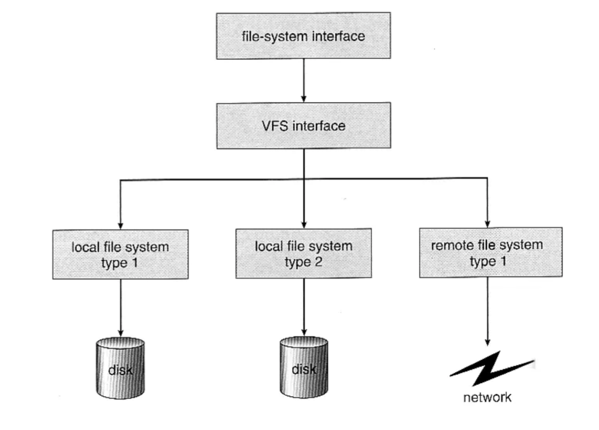

# 파일 시스템

파일 시스템? 운영체제가 저장매체에 파일을 쓰기 위한 자료구조 또는 알고리즘

#### 파일 시스템이 만들어진 이유
1. 비트(0, 1)로 관리하기에는 오버헤드가 커서 블록 단위(보통 4KB)로 관리하기로 했다.
   - 블록마다 고유 번호를 부여해서 관리
2. 사용자가 각 블록 고유 번호를 관리하기가 어렵다. 추상적(논리적) 객체가 필요 (파일)
   - 사용자는 파일 단위로 관리하고, 각 파일에는 블록 단위로 관리

#### 파일 시스템 저장 방법
- 처음에는 가능한 연속적인 공간에 파일을 저장하는 것이 좋다고 생각했으나, 외부 단편화, 파일 사이즈 변경 문제로 불연속 공간에 파일 저장 기능 지원이 필요함을 알게 되었다.

1. 블록 체인: 블록을 링크드 리스트로 연결. 끝에 있는 블록을 찾으려면, 맨 처음 블록부터 주소를 따라가야만 한다.
2. 인덱스 블록 기법: 각 블록에 대한 위치 정보를 기록. 한번에 끝 블록을 찾아갈 수 있도록 한다.

## 파일 시스템과 시스템 콜
- 동일한 시스템콜을 사용해서 다양한 파일 시스템 지원이 가능하도록 구현한다.
  - read/write 함수 호출 시, 각 기기 및 파일 시스템에 따라 실질적인 처리를 담당하는 함수 구현
  - 파일을 실제 어떻게 저장할지는 다를 수 있다.
  - 리눅스의 경우, ext4 외 NTFS, FAT32 파일 시스템을 지원한다.

 

## inode 방식 파일 시스템

#### 기본 구조
- 수퍼 블록: 파일 시스템 정보 및 파티션 정보 포함
    

- 아이노드 블록: 파일 상세 정보
    - 파일: inode 고유 값과 자료 구조에 의해 주요 정보를 관리한다.
    - '파일이름:inode'로 파일 이름은 inode 번호와 매칭한다.
    - 파일 시스템에서는 inode를 기반으로 파일 엑세스한다.
    
    - inode 기반 메타 데이터(파일 권한, 소유자 정보, 파일 사이즈, 생성 시간 등 시간 관련 정보, 데이터 저장 위치 등) 저장
    
    
    

- 데이터 블록: 실제 정보

 

## 디렉토리 엔트리
- 리눅트 파일 탐색 Ex) /home/ubuntu/link.txt
  
  1. 각 디렉토리 엔트리(dentry) 탐색
     - 각 엔트리는 해당 디렉토리 파일/디렉토리 정보를 가지고 있다.
  2. '/' dentry에서 'home'을 찾고, 'home'에서 'ubuntu'를 찾고, 'ubuntu'에서 'link.txt' 파일 이름에 해당하는 inode를 얻는다.
  

 

## 가상 파일 시스템 (Virtual File System)
- Network 등 다양한 기기도 동일한 파일 시스템 인터페이스를 통해 관리가 가능하다.
- Ex) read/write 시스템 콜 사용, 각 기기별 read_spec/write_spec 코드 구현 (운영체제 내부)

