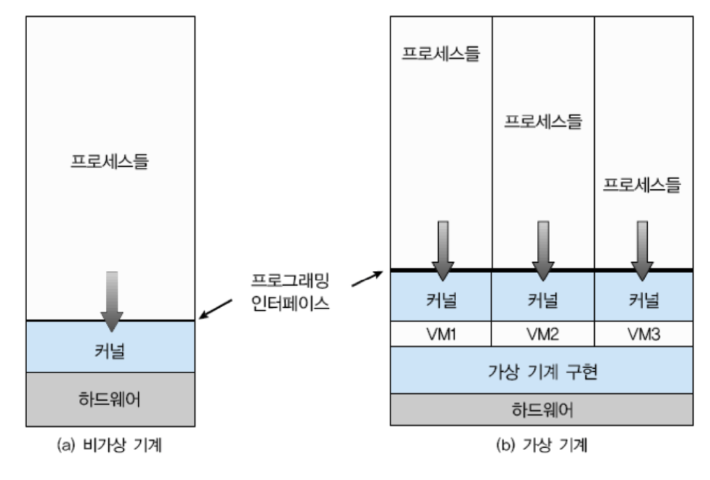
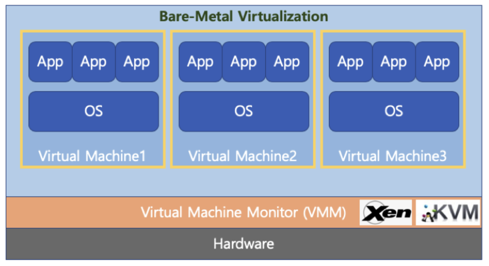
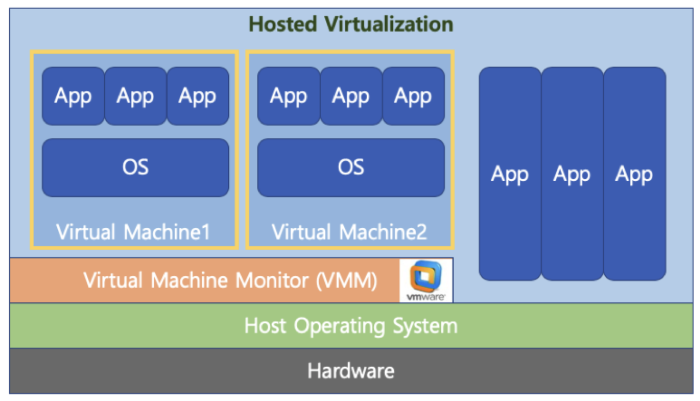
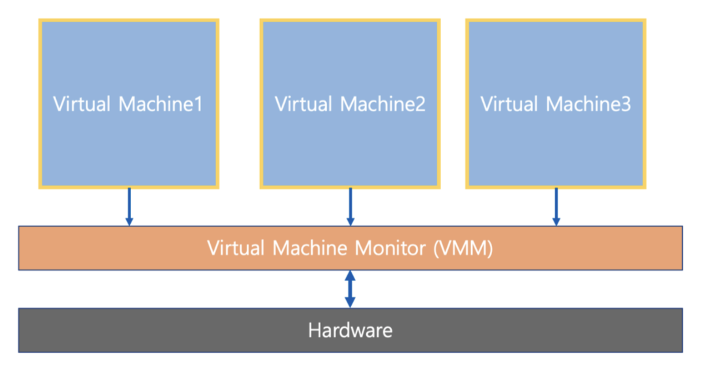
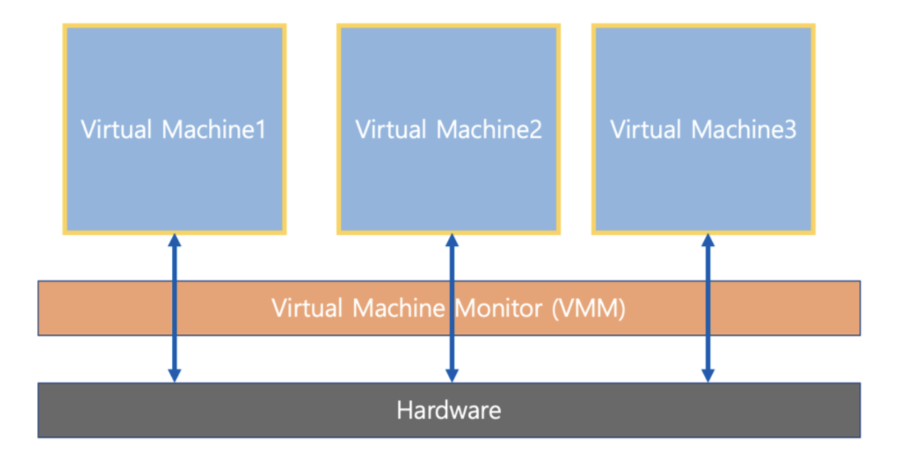
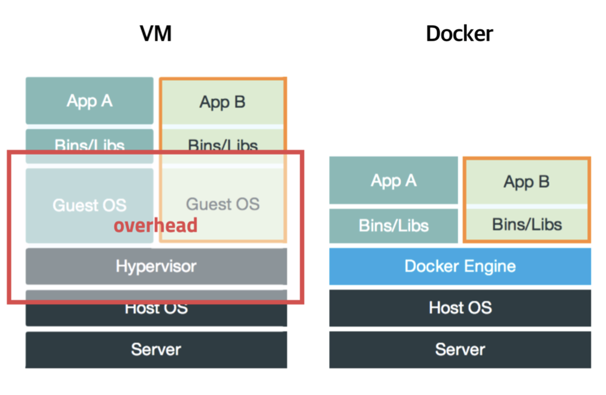
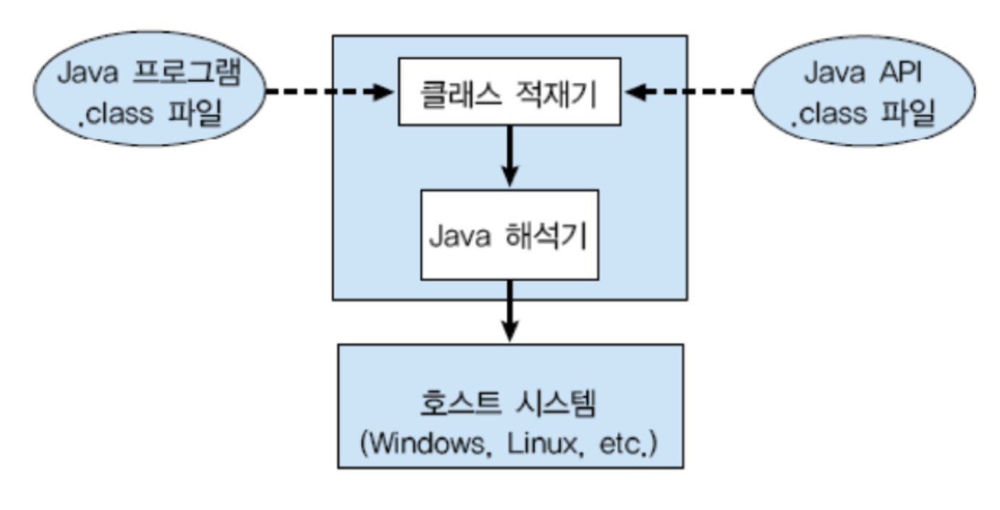

# 가상머신

## Virtual Machine (가상머신)
- 하나의 하드웨어(CPU, Memory 등)에 다수의 운영체제를 설치하고, 개별 컴퓨터처럼 동작하도록 하는 프로그램
  

> 하이퍼 바이저(또는 VMM) : 운영 체제와 응용프로그램을 물리적 하드웨어에서 분리하는 프로세스

### Virtual Machine Type1 (native 또는 bare metal)
- 하이퍼바이저 또는 버츄얼 머신 모니터(VMM)라고 하는 소프트웨어가 Hardware에서 직접 구동
- Xen, KVM

 

### Virtual Machine Type2
- 하이퍼바이저 또는 버츄얼 머신 모니터(VMM)라고 하는 소프트웨어가 Host OS 상위에 설치
- VMWare, Parallels Desktop (Mac)

 

### Full Virtualization(전가상화) vs Half Virtualization(반가상화)

**전가 상화**
- 각 가상머신이 하이퍼바이저를 통해서 하드웨어와 통신
- 하이퍼바이저가 마치 하드웨어인 것처럼 동작하므로, 가상머신의 OS는 자신이 가상 머신인 상태인지를 모른다.

 

**반가상화**
- 각 가상머신에서 직접 하드웨어와 통신
- 각 가상머신에 설치되는 OS는 가상머신인 경우, 이를 인지하고 각 명령에 하이퍼바이저 명령을 추가해서 하드웨어와 통신한다.

> 최근 HW 성능 개선으로 전가상화 기술을 선호한다.

 

### 또 다른 가상 머신 Docker (가상머신 vs Docker)
- 가상 머신은 컴퓨터 하드웨어를 가상화 (하드웨어 전체 추상화)
  - 하이퍼바이저 사용, 추가 OS 필요 등 성능 저하 이슈 존재
- Docker는 운영체제 레벨에서 별도로 분리된 실행환경을 제공한다. (커널 추상화)
  - 마치 리눅스 처음 설치했을 때와 유사한 실행환경을 만들어주는 리눅스 컨테이너 기술 기반
  - macOS나 windows에 설치할 경우, 가상머신 기반 제공

 

### Java Virtual Machine
- 가상 머신과는 다른 목적 (응용프로그램 레벨 가상화)
- Java 컴파일러는 CPU dependency를 가지지 않는 bytecode를 생성하고 이 파일을 Java Virtual Machine 에서 실행한다.
- 각 운영체제를 위한 Java Virtual Machine 프로그램이 존재한다.

