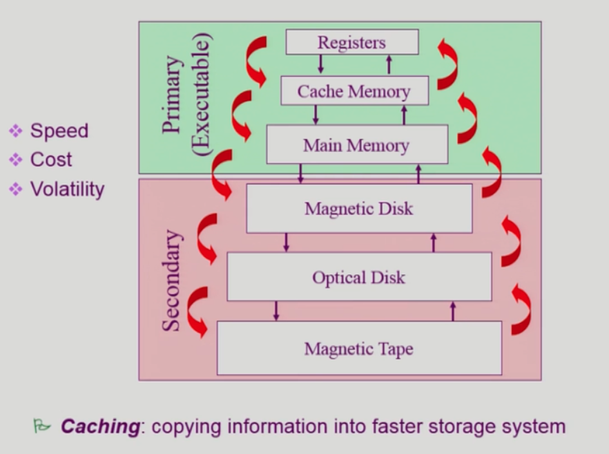
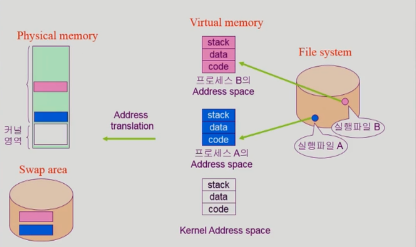
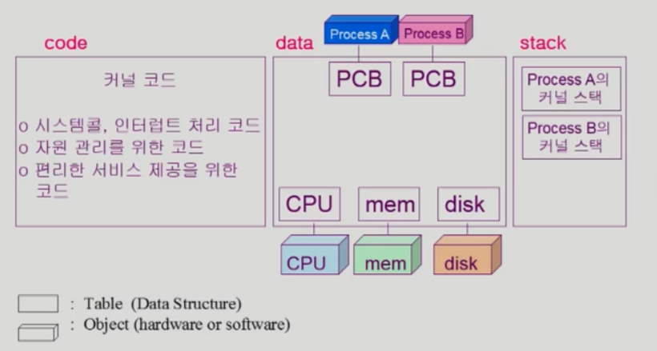

# System structure & Program Execution
-

## Mode bit
- 사용자 프로그램의 잘못된 수행으로 다른 프로그램 및 운영체제에 피해가 가지 않도록 하기 위한 보호 장치 필요
- Mode Bit을 통해 하드웨어적으로 두가지 모드의 operation 지원
	- 1: 사용자 모드: 사용자 프로그램 스행
	- 0: 모니터 모드(= 커널모드, 시스템 모드): OS 코드 수행 
	- 보안을 해칠 수 있는 중요한 명령어는 모니터 모드에서만 수행 가능한 **특권명령**으로 규정
	- Interrupt나 Exception 발생 시 하드웨어가 mode bit을 0으로 바꿈
	- 사용자 프로그램에게 CPU를 넘기기 전에 mode bit을 1로 세팅

## Timer
- 정해진 시간이 흐른 뒤 운영체제에게 제어권이 넘어가도록 인터럽트를 발생시킨다.
- 타이머는 매 클럭 틱 때마다 1씩 감소
- 타이머 값이 0이 되면 타이머 인터럽트 발생
- CPU를 특정 프로그램이 독점하는 것으로부터 보호

- 타이머는 time sharing을 구현하기 위해 널리 이용된다.
- 타이머는 현재 시간을 계산하기 위해서도 사용된다.

## 인터럽트 (Interrupt)
- 현대의 운영체제는 인터럽트에 의해 구동된다.
- 독점권을 막기 위해 Timer 인터럽트 발생
- 프로그램이 파일을 읽어올 때 운영체제 부탁을 하기 위해서 System Call을 할 때 CPU 제어권을 운영체제에게 넘어가게끔 인터럽트를 건다.
  
- 인터럽트 당한 시점의 레지스터와 program counter를 save한 후 CPU의 제어를 인터럽트 처리 루틴에 넘긴다.
- Interrupt (넓은 의미)
	-  Interrupt (하드웨어 인터럽트): 하드웨어가 발생시킨 인터럽트
	-  Trap (스프트웨어 인터럽트)
		 - Exception: 프로그램이 오류를 범한 경우
		 - System Call: 프로그램이 커널 함수를 호출하는 경우

- 인터럽트 벡터
	- 해다우 인터럽트의 처리 루틴 주소를 가지고 있다.
- 인터럽트 처리 루틴 (=Interupt Service Routine, 인터럽트 핸들러)
	- 해당 인터럽트를 처리하는 커널 함수
	

## 시스템 콜(System Call)
- 사용자 프로그램이 운영체제의 서비스를 받기 위해 커널 함수를 호출하는 것

## Device Controller
- I/O device controller
	- 해당 I/O 장치유형을 관리하는 CPU
	- 제어 정보를 위해 control, register, status register를 가진다.
	- local buffer를 가짐 (일종의 data register)
- I/O는 실제 device와 local buffer 사이에서 일어난다.
- Device controller는 I/O가 끝났을 경우 interrupt로 CPU에 그 사실을 알린다.

> device driven(장치구동기): OS 코드 중 각 장치별 처리 루틴 -> software  
> device controller(장치제어기): 각 장치를 통제하는 일종의 작은 CPU -> hardware

## 동기식 입출력과 비동기식 입출력
- 동기식 입출력 (synchronous I/O)
	- i/O 요청 후 입출력 작업이 완료된 후에야 제어가 사용자 프로그램에 넘어간다.
	- 구현 방법 1 (I/O가 끝날 때까지 CPU 제어권을 갖고 있는 경우)
		- I/O 가 끝날 때까지 CPU를 낭비시킨다.
		- 매시점 하나의 I/O 만 일어날 수 있다.
	- 구현 방법 2
		- I/O가 완료될 때까지 해당 프로그램에게서 CPU를 빼앗는다.
		- I/O 처리를 기다리는 줄에 그 프로그램을 줄 세운다.
		- 다른 프로그램에게 CPU를 준다.

- 비동기식 입출력 (Asynchronous I/O)
	- I/O가 시작된 후 입출력 작업이 끝나기를 기다리지 않고 제어가 사용자 프로그램에 즉시 넘어간다.

> 두 경우 모두 I/O의 완료는 인터럽트로 알려준다.

## DMA (Direct Memory Access)
- 빠른 입출력 장치를 메모리에 가까운 속도로 처리하기 위해 사용
- CPU의 중재 없이 device controller가 device의 buffer storage의 내용을 메모리에 **block** 단위로 직접 전송
- 바이트 단위가 아니라 block 단위로 인터럽트를 발생시킨다.
- 덜 빈번하게 인터럽트를 발생시킬 수 있다.

## 서로 다른 입출력 명령어
- I/O를 수행하는 special instruction에 의해 
- Memory Mapped I/O에 의해

## 저장장치 계층 구조

## 프로그램의 실행 (메모리 load)

- **프로그램**은 파일 시스템에 파일 형태로 저장되어 있다.
- 프로그램을 실행 시키면, 메모리에 올라가서 **프로세스**가 된다.
- 메모리에는 운영체제의 커널이 기본적으로 올라가있으며, 프로세스는 사용자가 실행시킬 때 올라간다.
- 프로그램이 실행 될 때는 Virtual Memory 가 만들어 진다. (0번지 부터 시작하는 각 프로세스들만의 주소)

- 당장 필요한 부분은 물리적인 메모리에 올라가고, 그렇지 않은 부분 Swap area에 내려가 있다. 일부는 파일 시스템에 실행 파일 형태로 존재하게 된다.
- 논리적은 주소/물리적인 주소 간에는 Adress translation 이 필요하다.

### 프로세스
- 각각의 virtual memory는 code/data/stack으로 구성된다.
- code: 기계어 코드
- data: 프로그램이 실행될 때 사용하는 memory data (전역변수, 프로그램이 실행될 때부터 종료될 때까지 남아있는 Data)
- stack: 함수 호출/리턴과 관련된 정보 등을 담고 있다.

## 커널 주소 공간의 내용

- 커널도 하나의 프로그램으로서 함수 구조로 되어있다 = 커널도 code/data/stack구조로된 virtual memory가 있다.

## 사용자 프로그램이 사용하는 함수
**함수 (function)**

- 사용자 정의 함수
	- 자신의 프로그램에서 정의한 함수
- 라이브러리 함수
	- 자신의 프로그램에서 정의하지 않고 갖다 쓴 함수
	- 자신의 프로그램의 실팽 파일에 포함되어 있다.
- 커널 함수
	- 운영체제 프로그램의 함수
	- 커널 함수의 호출 = 시스템 콜