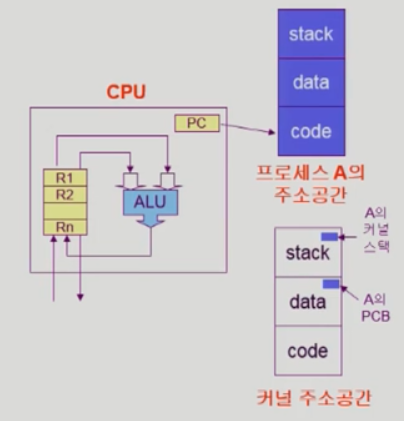

# Process

## 프로세스의 개념
- "Process is **a program in execution**
- 프로세스의 문맥 (context)
	- CPU 수행 상태를 나타내는 하드웨어 문맥
		- Program Counter
		- 각종 register
	- 프로세스의 주소 공간
		- code, data, stack
	- 프로세스 관련 커널 자료 구조
		- PCB (Process Control Block)
		- Kernel stack

## 프로세스의 상태 (Process Status)
프로세스는 상태가 변경되며 수행된다.

- Running
	- CPU를 잡고 instruction을 수행 중인 상태
- Ready
	- CPU를 기다리는 상태(메모리 등 다른 조건을 모두 만족하고)
- Blocked (wait, slep)
	- CPU를 주어도 당장 instruction을 수행할 수 없는 상태
	- Process 자신이 요청한 event(예: I/O)가 즉시 만족되지 않아 이를 기다리는 상태
	- Ex) 디스크에서 file을 읽어와야 하는 경우
- New: 프로세스가 생성 중인 상태
- Terminated: 수행(execution)이 끝난 상태

## Process Control Block (PCB)
- 운영체제가 각 프로세스를 관리하기 위해 프로세스 당 유지하는 정보

1. OS가 사용하는 정보
	- Process state, Process ID,
	- scheduling information, priority
2. CPU 수행 관련 하드웨어 값
	- Program Counter, registers
3. 메모리 관련
	- Code, data, stack의 위치 정보
4. 파일 관련
	- Open file descriptors ...

## 문맥 교환 (Context Switch)
- CPU를 한 프로세스에서 다른 프로세스로 넘겨주는 과정
- CPU가 다른 프로세스에게 넘겨갈 때 운영체제는 다음을 수행
	- CPU를 내어주는 프로세스의 상태를 그 프로세스의 PCB에 저장
	- CPU를 새롭게 얻는 프로세스의 상태를 PCB에서 읽어온다.

- System call이나 interrupt 발생 시 반드시 context switch가 발생하는 것은 아니다.

1. **사용자 프로세스 A** → kernel mode → **사용자 프로세스 A** 
	- interrupt or system call
	- 이 때는 문맥 교환 없이 user mode로 복귀한다.
	- 이 경우에도 CPU 수행 정보 등 context의 일부를 PCB에 save를 해야하기는 한다.
2. **사용자 프로세스 A** → kernel mode → **사용자 프로세스 B**
	- timer interrupt or I/O 요청 system call
	- 문맥 교환이 일어난다.
	- 1에 비해 문맥교환을 하기 때문에 부담이 훨씬 크다(eg. cache memory flush)

## 프로세스를 스케줄링하기 위한 큐
- Job queue
	- 현재 시스템 내에 있는 모든 프로세스의 집합
- Ready queue
	- 현재 메모리에 있으면서 CPU를 잡아서 실행되기를 기다리는 프로세스의 집합
- Device queues
	- I/O device의 처리를 기다리는 프로세스의 집합
- 프로세스들은 각 큐들을 오가며 수행된다.

