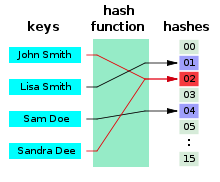
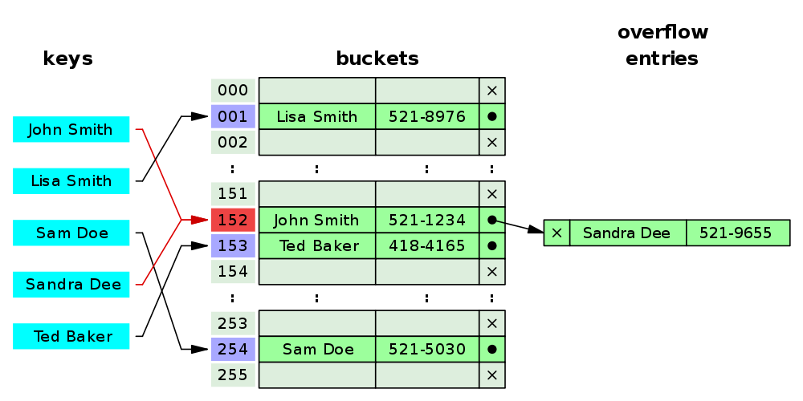

# Hash
## 해싱(Hashing)
* 임의의 길이의 값을 해시 함수를 사용하여 고정된 크기의 값으로 변환하는 작업.
* 해싱을 사용하여 데이터를 저장하는 자료구조를 해시 테이블이라고 한다.

## 해시 테이블 (Hash Table)
* 해시 함수를 사용하여 변환한 값(Hash Code)을 색인(index)으로 삼아 키(Key)와 데이터(Value)를 저장하는 자료구조를 의미.
* 연관배열(associative array) 구조를 이용한다.
* 빠르게 데이터를 검색할 수 있는 자료구조. 빠른 검색 속도를 제공하는 이유는 내부적으로 배열(버킷)을 사용하여 데이터를 저장하기 때문. 실제 값이 저장되는 장소를 버킷 또는 슬롯이라고 한다.
* 기본연산으로는 탐색(Search), 삽입(Insert), 삭제(Delete)가 있다.

### 특징
* 키(Key)와 값(Value)를 가진다.
* 해시 맵(hash maps), 맵(maps), 딕셔너리(dictionaries), 연관 배열(associative arrays) 라는 이름으로도 알려져 있다.

### 구성요소
* **Key**
	* 고유한 값
	* Hash Function 의 input 이 된다.
	* JavaScript Object의 Key와 비슷하다.
* **Value**
	* Key와 연관되어 한 쌍을 이루고 있는 값.
	* 우리가 검색해야 할 대상이다.
* **Hash Function** 
	* Key를 hash로 바꿔주는 알고리즘
* **Hash**
	* Array의 index와 비슷.
	* Value와 매칭되어 Value를 찾을 때 사용된다.
* **Bucket (Slot)** 
	* Value가 저장되는 곳.
	* 각 Bucket은 Hash로 접근.

### 성능
* 탐색, 삽입, 삭제 - 기본연산 모두 충돌이 없거나 적으면 O(1)의 상수 시간에 가까워지고, 충돌이 발생하면 할수록 성능은 점점 O(n)에 가까워진다.
* Best : O(1) / Worst : O(n)

- - - -

## Hash Collision (해시 충돌)
* 서로 다른 Key가 Hash Function을 통해 하나의 버킷에 매핑되는 경우
* 해시 함수는 해시 충돌이 자중 발생하지 않도록 구성되어야 한다.
* 암호학적 해시 함수의 경우, 해시 함수의 안정성을 깨뜨리는 충돌 공격이 가능할 수 있기 때문에 의도적인 해시 충돌을 만드는 것이 어렵도록 만들어야 한다.

### 문제점
* 해싱의 검출 속도를 떨어뜨리는 결과를 초래.
* 버킷 오버플로우 발생.

### 충돌 해결방법

1. **Separate Chaining** (분리 연결법, Open Hashing)
* 충돌이 발생했을 때 이를 동일한 버킷(Bucket)에 연결리스트 형태로 저장하는 방법.
* **장점**
	* 연결 리스트(Linked List)를 이용하기 때문에, 추가할 수 있는 데이터의 제약이 적다.
	* 테이블의 높은 부하율이 예상되거나, 데이터가 크거나, 데이터의 길이가 가변일 때 성능이 좋아진다.
	* 미리 충돌을 대비해서 공간을 많이 잡아 놓을 필요가 없다.
* **단점**
	* 같은 Hash에 자료들이 많이 연결되면 검색 시 효율이 낮아진다.
	* 외부 저장 공간 작업을 추가로 해야한다.
* **시간 복잡도**
	* n : len(Bucket), m : len(key)
	* a : m/n - 1개의 Hast 당 평균적으로 들어있는 키의 개수
	* 삽입(insert) : Best - O(1) / Worst - O(N)
	* 삭제(delete), 탐색 (search) : Best - O(a), Worst - O(N)

2. **Open Addressing (Closed Hashing)**
* 충돌이 발생했을 경우 연결리스트와 같이 추가적인 메모리를 사용하지 않고, 해시 테이블(Hash Table)의 빈 버킷(Bucket)을 이용하는 방법.
* 정해진 해시테이블내에서만 저장이 되는 특징이 있어, Closed Hasing(폐쇄 해싱)이라고 한다.

* 다음 버킷 결정 방법
	* **선형 탐색** : 충돌이 일어난 바로 다음 자리에 저장하는 방법
	* **제곱 탐색** : 충돌이 일어난 해시의 제곱을 한 해시에 저장하는 방법
	* **이중 해시** : 다른 해시 함수를 한 번 더 적용한 해시에 저장하는 방법

* **장점**
	* 또 다른 저장공간이 없이 해시테이블 내에서 데이터 저장 및 처리가 가능.
	* 또 다른 저장공간에서의 추가적인 작업이 없다.
* **단점**
	* 해시 함수(Hash Function)의 성능에 전체 해시 테이블 성능이 좌지우지된다.
	* 데이터 길이가 늘어나면, 그에 해당하는 저장소를 마련해두어야 한다.
	* m : 현재 버켓 차있는 양, n : 전체 버켓 양, a : m/n(a <= 1) 
	=> a에 따라서 성능이 차이가 난다.
* **시간 복잡도**
	* n : len(Bucket)
	* Best : O(1) / Worst : O(n)

> 참고  
> [Hash Table 이해하기. Data Structure in JavaScript 자바스크립트… | by elenaJEL | amhoCode | Medium](https://medium.com/amhocode/hash-table-%EC%A0%9C%EB%8C%80%EB%A1%9C-%EC%9D%B4%ED%95%B4%ED%95%98%EA%B8%B0-2223f2ae1528)  
> [그림으로 개념을 이해하는 알고리즘 Hash Table (해시테이블)](https://jtoday.tistory.com/73)  
> [해시 충돌 - 위키백과, 우리 모두의 백과사전](https://ko.wikipedia.org/wiki/%ED%95%B4%EC%8B%9C_%EC%B6%A9%EB%8F%8C)  
> [해시 테이블(Hash Table)](https://dev-kani.tistory.com/1)  
> [Data Structure 기본 개념 (2) - hash table - 배지77의 블로그](https://baeji77.github.io/cs/data-structure/data-structure(2)/)  
>   

